# 前馈神经网络(feedforward neural network)

# 1 相关概念

## 1.1 人工智能是什么

## 1.2 深度学习与人工智能的关系

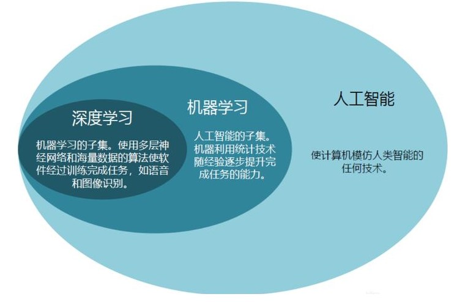

## 1.3 深度学习的概念
&nbsp;&nbsp;&nbsp;&nbsp;&nbsp;&nbsp;&nbsp;&nbsp;深度学习（英语：deep learning）是机器学习的分支，是一种以人工神经网络为架构，对资料进行表征学习的算法。 

*(注释：在机器学习中，特征学习（feature learning）或表征学习（representation learning）[1]是学习一个特征的技术的集合：将原始数据转换成为能够被机器学习来有效开发的一种形式。它避免了手动提取特征的麻烦，允许计算机学习使用特征的同时，也学习如何提取特征：学习如何学习。）*

&nbsp;&nbsp;&nbsp;&nbsp;&nbsp;&nbsp;&nbsp;&nbsp;深度学习旨在通过构建和训练**多层神经网络**来实现人工智能任务。它模拟了人脑神经元之间的相互连接和信息传递方式，通过学习大量数据来提取特征和模式，并用于分类、识别、预测和决策等任务。 

## 1.4 什么是人工神经网络
&nbsp;&nbsp;&nbsp;&nbsp;&nbsp;&nbsp;&nbsp;&nbsp;人工神经网络（英语：artificial neural network，ANNs）简称神经网络（neural network，NNs）或类神经网络，在机器学习和认知科学领域，是一种模仿生物神经网络（动物的中枢神经系统，特别是大脑）的结构和功能的数学模型或计算模型，用于对函数进行估计或近似。 
&nbsp;&nbsp;&nbsp;&nbsp;&nbsp;&nbsp;&nbsp;&nbsp;神经网络由大量的人工神经元联结进行计算。大多数情况下人工神经网络能在外界信息的基础上改变内部结构，是一种自适应系统，通俗地讲就是具备学习功能。 
&nbsp;&nbsp;&nbsp;&nbsp;&nbsp;&nbsp;&nbsp;&nbsp;现代神经网络是一种**非线性统计性**数据建模工具，神经网络通常是通过一个基于数学统计学类型的学习方法（learning method）得以优化，所以也是数学统计学方法的一种实际应用，通过统计学的标准数学方法我们能够得到大量的可以用函数来表达的局部结构空间，另一方面在人工智能学的人工感知领域，我们通过数学统计学的应用可以来做人工感知方面的决定问题（也就是说通过统计学的方法，人工神经网络能够类似人一样具有简单的决定能力和简单的判断能力），这种方法比起正式的逻辑学推理演算更具有优势。 

## 1.5 前馈神经网络的概念
&nbsp;&nbsp;&nbsp;&nbsp;&nbsp;&nbsp;&nbsp;&nbsp;深度前馈网络（deep feedforward network), 也叫作前馈神经网络（feedforward neural network）或者多层感知机(multilayer perceptron, MLP), 是典型的深度学习模型。  

# 2 神经元模型
## 2.1 M-P 神经元
**生物学中的神经元**

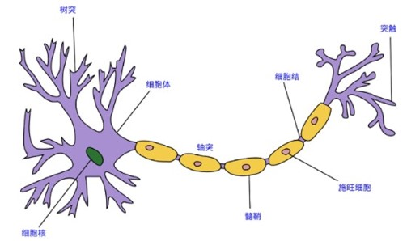

1943 年，[McCulloch and Pitts, 1943] 将神经元抽象为数学概念上的的简单模型，这就是一直沿用至今的 **M-P 神经元模型：**  

&nbsp;&nbsp;&nbsp;&nbsp;&nbsp;&nbsp;&nbsp;&nbsp;在这个模型中， 神经元接收到来自 n 个其他神经元传递过来的输入信号, 这些输入信号通过带权重的连接(onnection)进行传递，神经元接收到的总输入值(sum)将与神经元的阀值进行比较，然后通过**激活函数(activation function)** 处理以产生神经元的输出。 

## 2.2 经典激活函数
&nbsp;&nbsp;&nbsp;&nbsp;&nbsp;&nbsp;&nbsp;&nbsp;最初的激活函数是下图左所示的阶跃函数，它将输入值映射为输出值 0 或 1, 显然 "1" 对应于神经元兴奋， "0" 对应于神经元抑制. 然而，阶跃函数具有不连续、不光滑等不太好的性质，因此实际常用Sigmoid函数作为激活函数(注释：目前已经有很多更好的激活函数)。 典型的Sigmoid 函数如图下图右所示， 它把可能在较大范围内变化的输入值挤压到(0，1) 输出值范围内，因此有时也称为"挤压函数（squashing function）"。 

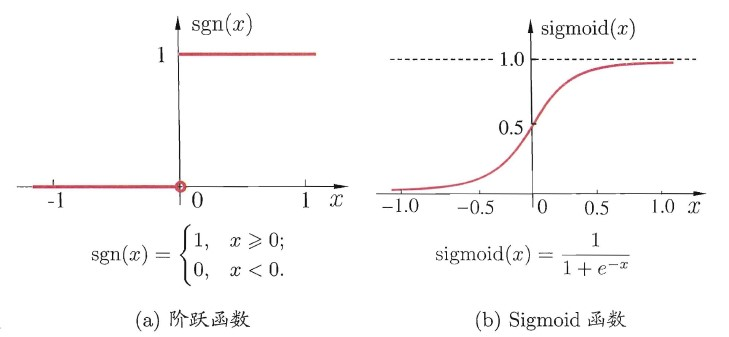

# 3 从神经元到感知机

**逻辑回归 vs 神经元**

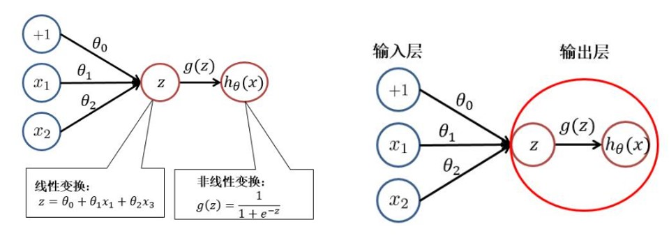

&nbsp;&nbsp;&nbsp;&nbsp;&nbsp;&nbsp;&nbsp;&nbsp;感知机（perceptron）是由两层神经元组成的结构，输入层用于接受外界输入信号，输出层（也被称为是感知机的功能层）就是M-P神经元，亦称“阈值逻辑单元”（threshold logic unit）。感知机的结构如下： 

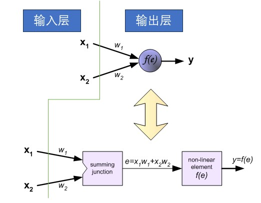

## 3.1 使用感知机解决线性可分问题
&nbsp;&nbsp;&nbsp;&nbsp;&nbsp;&nbsp;&nbsp;&nbsp;简单来说，如果可以使用一条线将数据集分为两个类别，则称该问题是线性可分的。比如：在一群猫和狗中，将猫分离出来。而非线性可分问题的数据集包含两种以上的类别，所以需要非线性线将它们分成各自的类别。比如：对手写数字的分类，因为它包含了两种以上的类别，所以要使用非线性线将其分类。 
**线性可分与线性不可分**  
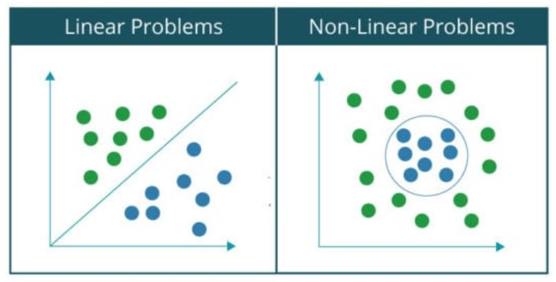

**数学模型**  
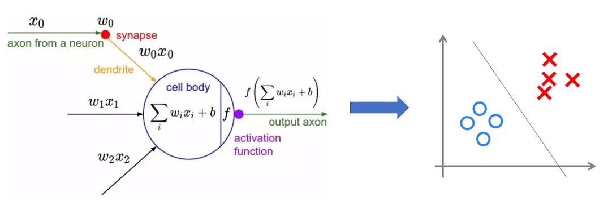

**使用感知机解决与(And) 问题**

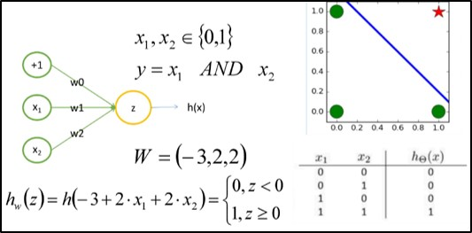

**使用感知机解决或(Or) 问题**

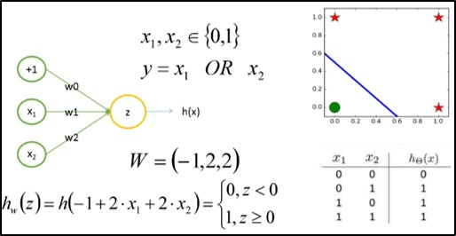

**使用感知机解决异非（Not）问题**

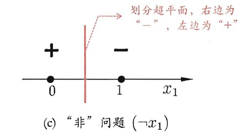

- 思考：此时 $x_{1}, x_{2}$ 分别是多少呢？

## 3.2 如何解决异或问题 ？？？
**异或问题如下图所示：**

**解题思路：多次分割解决分线性**

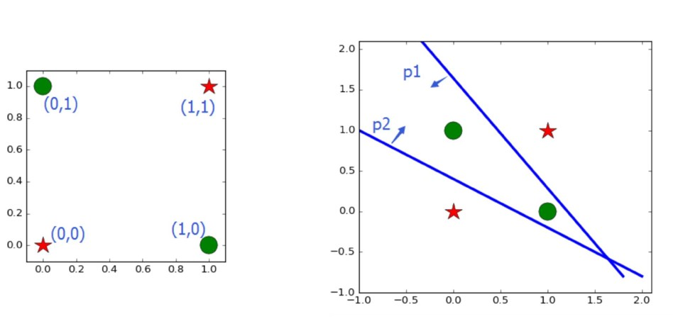

**多层神经元解决非线性问题**

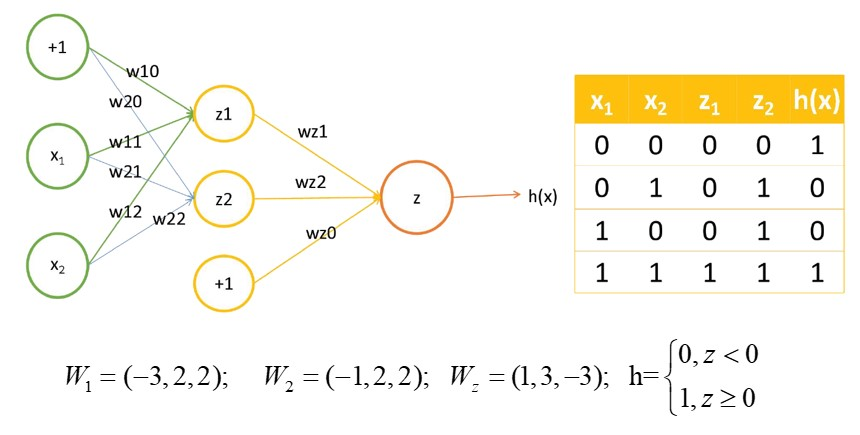

# 4 从感知机到深度神经网络
&nbsp;&nbsp;&nbsp;&nbsp;&nbsp;&nbsp;&nbsp;&nbsp;我们可以通过在网络中加入一个或多个隐藏层来克服线性模型的限制， 使其能处理更普遍的函数关系类型。 要做到这一点，最简单的方法是将许多全连接层堆叠在一起。 每一层都输出到上面的层，直到生成最后的输出。 我们可以把前L−1层看作表示，把最后一层看作线性预测器。 这种架构通常称为多层感知机（multilayer perceptron），通常缩写为MLP。 

&nbsp;&nbsp;&nbsp;&nbsp;&nbsp;&nbsp;&nbsp;&nbsp;更一般的，常见的神经网络是形如下图所示的层级结构，每层神经元与下层神经元全互连，神经元之间不存在同层连接，也不存在跨层连接. 这样的神经网络结构通常称为**多层前馈神经网络(multi-layer feedforward neural network）**  

习惯上，我们通常将 Layer 大于两层的 MLP 或 MultiLayer feedforward neural network 简称为深度神经网络，其典型结构如下图所示： 

## 4.1 为何要用深度神经网络？
&nbsp;&nbsp;&nbsp;&nbsp;&nbsp;&nbsp;&nbsp;&nbsp;理论和实践都反复证明，随着隐层的增加，模型的表征能力也会增加，可以解决的问题也更加广泛，如下图所示： 

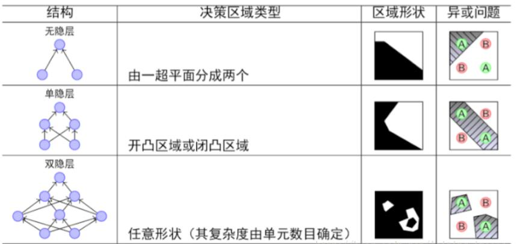

- 结论：随着隐层层数的增多，凸域将可以形成任意的形状，因此可以解决任何复杂的分类问题。实际上，Kolmogorov理论指出：双隐层感知器就足以解决任何复杂的分类问题。于是我们可以得出这样的结论：**神经网络**通过将线性分类器进行组合叠加，能够较好地进行**非线性分类**。 

**多分类问题的解决**

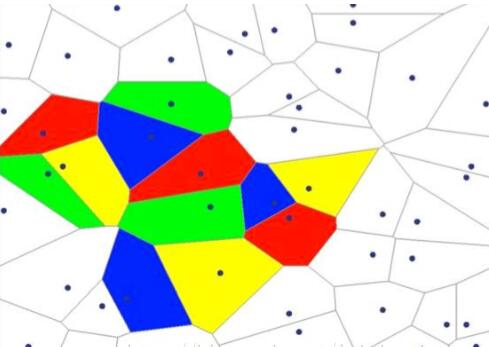

## 4.2 深度神经网络解决问题案例
&nbsp;&nbsp;&nbsp;&nbsp;&nbsp;&nbsp;&nbsp;&nbsp;假设深度学习要处理的信息是“水流”，而处理数据的深度学习网络是一个由管道和阀门组成的巨大水管网络。网络的入口是若干管道开口，网络的出口也是若干管道开口。这个水管网络有许多层，每一层由许多个可以控制水流流向与流量的调节阀。根据不同任务的需要，水管网络的层数、每层的调节阀数量可以有不同的变化组合。对复杂任务来说，调节阀的总数可以成千上万甚至更多。水管网络中，每一层的每个调节阀都通过水管与下一层的所有调节阀连接起来，组成一个从前到后，逐层完全连通的水流系统。 

**案例：深度神经网络识别汉字：**  

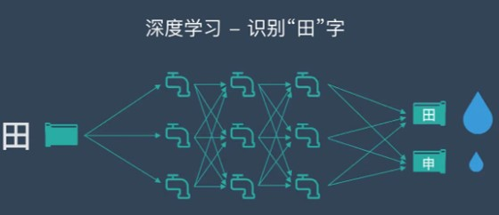

# 5 前馈神经网络计算流程
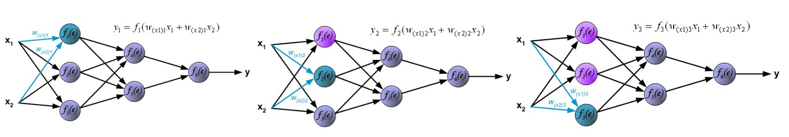

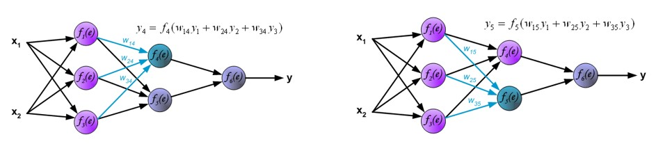

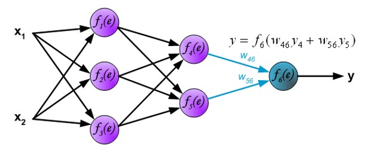

# 6 深度学习与传统机器学习
## 6.1 相同点
&nbsp;&nbsp;&nbsp;&nbsp;&nbsp;&nbsp;&nbsp;&nbsp;在概念、数据准备和预处理方面，两者是很相似的，他们都可能对数据进行一些操作： 
- 数据清洗
- 数据标签
- 归一化
- 去噪
- 降维

## 6.2 不同点

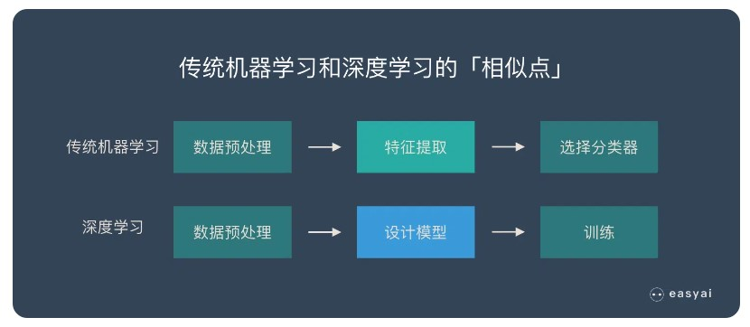

- 传统机器学习的特征提取主要依赖人工，针对特定简单任务的时候人工提取特征会简单有效，但是并不能通用。
- 深度学习的特征提取并不依靠人工，而是机器自动提取的。这也是为什么大家都说深度学习的可解释性很差，因为有时候深度学习虽然能有好的表现，但是我们并不知道他的原理是什么。

# 7 深度学习的特点
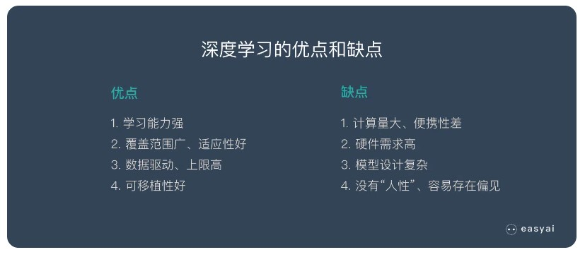

# 8 深度学习的典型算法

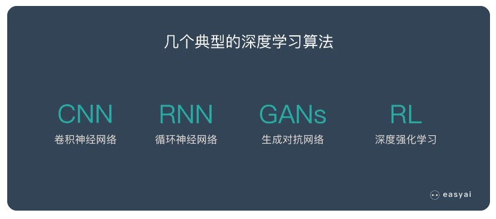

- **CNN** 能够将大数据量的图片有效的降维成小数据量(并不影响结果)，能够保留图片的特征，类似人类的视觉原理；
- **RNN** 是一种能有效的处理序列数据的算法。比如：文章内容、语音音频、股票价格走势…；
- **GAN** 是一种深度学习架构。 该架构训练两个神经网络相互竞争，从而从给定的训练数据集生成更真实的新数据；
- **强化学习(Reinforcement learning，简称RL)** 强调如何基于环境而行动，以取得最大化的预期利益,强化学习不需要带标签的输入输出对，而是通过自己不停的尝试来学会某些技能。

**注释：2017 年 出现了 Transfomer 模型，取得了重大成功，深度学习的众多项任务都开始应用 Transfomer 算法。**

# 9 参考文献
- [参考文献1](https://easyai.tech/ai-definition/deep-learning/)
- [参考文献2](https://www.cnblogs.com/lliuye/p/9183914.html)
- [参考文献3](http://galaxy.agh.edu.pl/~vlsi/AI/backp_t_en/backprop.html)

