# 1 概念理解

## 1.1 神经网络训练流程概述

&nbsp;&nbsp;&nbsp;&nbsp;&nbsp;&nbsp;&nbsp;&nbsp;当我们使用前馈神经网络（feedfowrward neural network）接收输入 x 并产生输出 y 时，信息通过网络向前流动。输入 x 提供初始信息，然后传播到每一层的隐藏单元，最终产生输出 y。这称之为前向传播（forward propagation）。
在训练过程中，前向传播可以持续向前直到它产生一个**标量** 的 损失函数 $J(\theta)$ 。
反向传播（back propagation）算法经常简称为backprop，允许来自代价函数的信息通过网络向后流动，以便计算梯度。<br>

## 1.2 反向传播的定义
&nbsp;&nbsp;&nbsp;&nbsp;&nbsp;&nbsp;&nbsp;&nbsp;反向传播（英语：Backpropagation，意为**误差**反向传播，缩写为BP）是对多层人工神经网络进行梯度下降的算法，也就是用**链式法则**以网络每层的**权重**为变量计算**损失函数**的梯度，以**更新权重**来最小化损失函数。<br>

# 2 梯度下降算法简述
- 多元函数 f 的梯度定义为：<br>
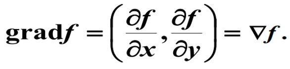

- 梯度有一个非常重要的性质：**函数f沿梯度方向增加（上升）最快, 函数f沿负梯度方向减小（下降）最快。**

- 梯度下降法(SGD)算法, ：<br>
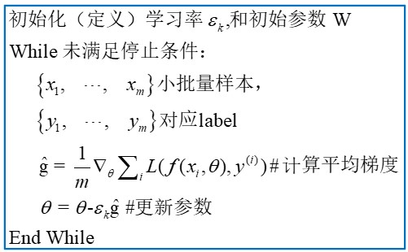

- 梯度下降法效果展示：<br>
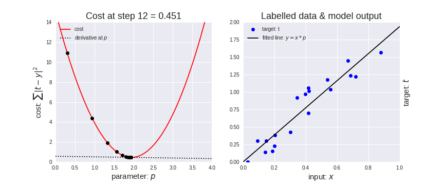

- 梯度下降法代码展示：<br>
```python
#coding:utf8
    
def fun(x,y):
    return x*x + y*y + 2*x +2

def dfun_x(x,y): 
    return 2*x + 2 

def dfun_y(x,y):
    return 2*y

if __name__ == '__main__':    
    x = 1
    y = 4
    lr = 0.01
    iters = 4000

    for iter in range(iters):
        x = x - lr* dfun_x(x, y)
        y = y - lr* dfun_y(x, y)
        print('loss = ', fun(x, y))
        print('x=',x)
        print('y=',y)
```

# 3 BP 或 深度神经网络训练需要明确的几个概念

一个典型的深度神经网络图如下：<br>
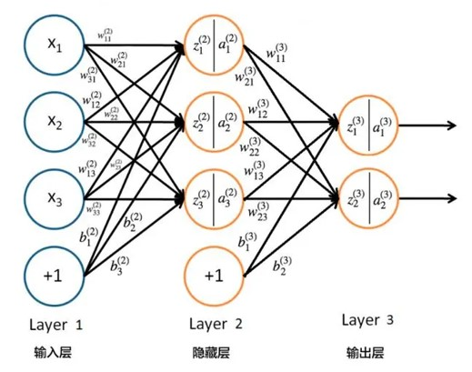

进一步，一个深度学习模型中的所有数据可划分为如下类别：
- 权重(weight) 或 参数(parameter)
- 激活(activation)
- 超参

**思考：请分析上图中参数的类别 ？？？**

再进一步，按照逻辑先后顺序反向传播算法（BP 算法）可划分为两个阶段：<br>
- 激励传播(反向传播)
- 权重更新

**思考： 反向传播的目的是求 激活的梯度 还是 权重的梯度 ？？？** <br>
**思考： 我们需要同时计算出 激活的梯度 和 权重的梯度吗 ？？？** <br>

# 4 链式求导法则
一个深度神经网络可以理解为一个复杂的复合函数：<br>
$$x = f(w); y = f(x); loss = f(y)$$

当计算 $\frac{\partial z}{\partial w}$ 时就需要用到链式求导, 链式求导有两种情况需要考虑：

- 情况一：无分支 <br>
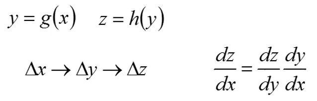

- 情况二：存在分支 <br>
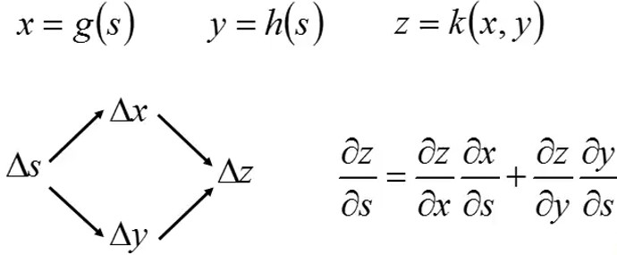

** ===== 有了以上背景知识，我们就可以进行反向传播(back propagation) 的计算了。======

# 5 BP 流程图示

&nbsp;&nbsp;&nbsp;&nbsp;&nbsp;&nbsp;&nbsp;&nbsp;在前馈神经网络最后，网络的输出信号 y 与目标值(label)进行比较，这个目标值可以在训练数据集中找到。这个差异(difference)被称为输出层神经元的误差信号 $\delta$ 。

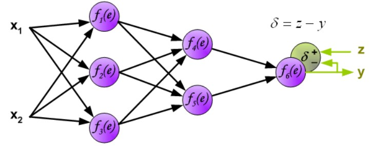

&nbsp;&nbsp;&nbsp;&nbsp;&nbsp;&nbsp;&nbsp;&nbsp;直接计算内部神经元的误差信号是不可能的，因为这些神经元的输出值是未知的。多层网络的有效训练方法长时间以来一直未知。直到上世纪八十年代中期，反向传播算法才被提出。其思想是将误差信号 d（在单个训练步骤中计算得出）传播回所有输出信号作为该神经元的输入的神经元中。<br>

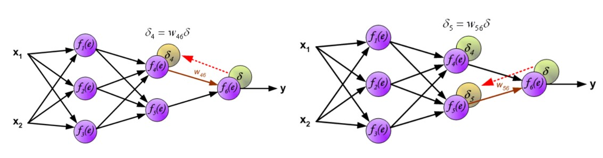

&nbsp;&nbsp;&nbsp;&nbsp;&nbsp;&nbsp;&nbsp;&nbsp;用于传播误差的权重系数 $w_{mn}$ 等于计算输出值时使用的权重系数。只是数据流的方向改变了（信号依次从输出传播到输入）。这种技术适用于所有网络层。如果传播的误差来自多个神经元，则进行相加。下面是示例图解：<br>

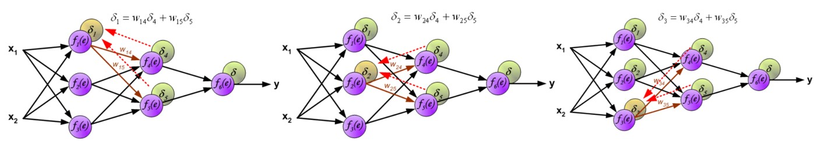

当计算完每个神经元的误差信号后，可以修改每个神经元输入节点的权重系数。<br>

- 第一层权重修改：<br>
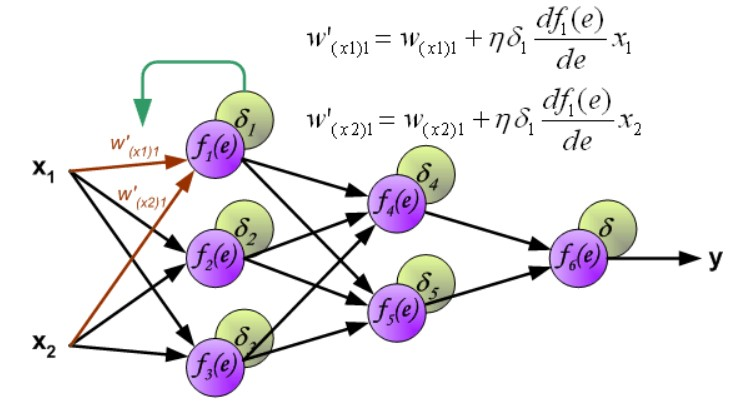
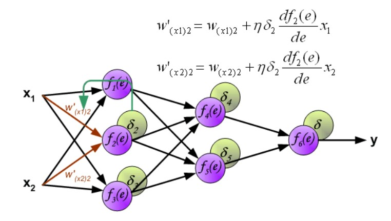
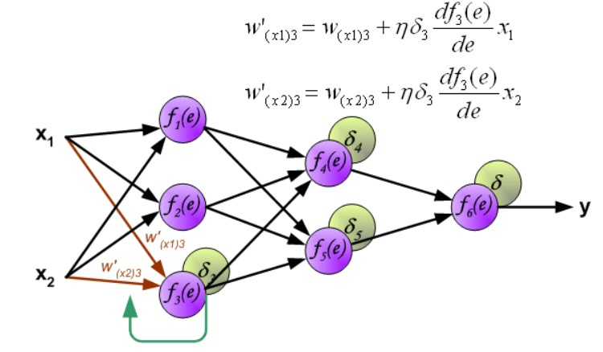

- 第二层权重修改：<br>
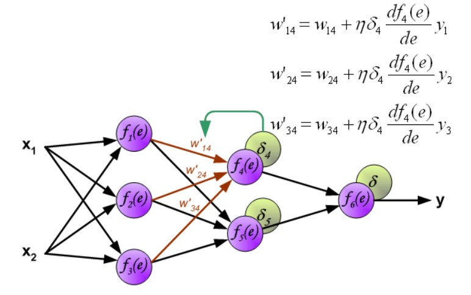
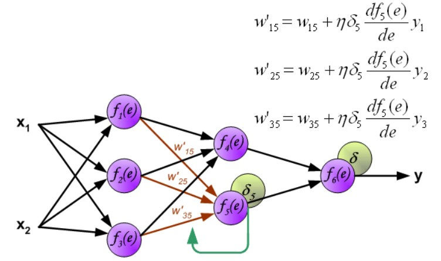

- 第三层权重修改：<br>
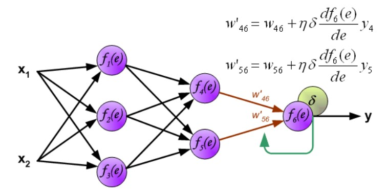


