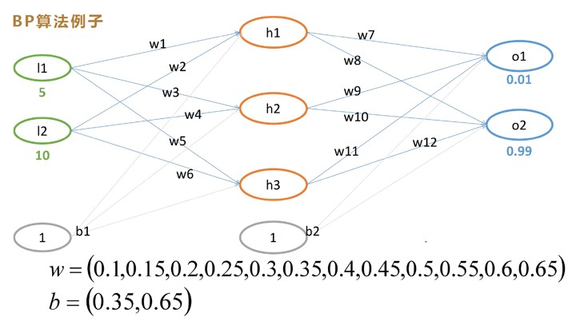
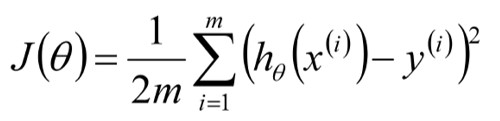
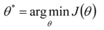
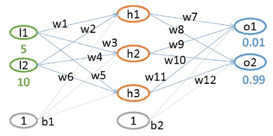
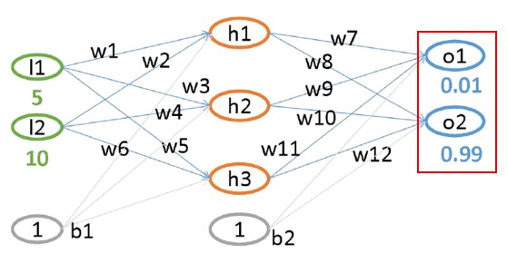
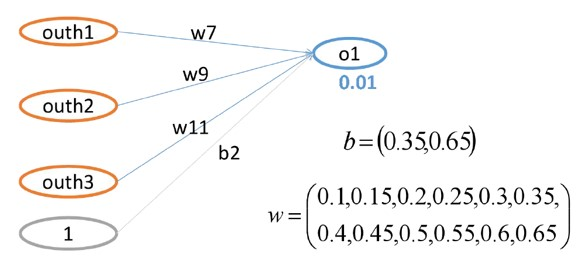

# 神经网络案例展示

# 1 题目：


其中：
- l1 和 l2 为 inputs
- wi 和 bi 为 weights
- o1 和 o2 为 outputs
- o1 的label 为 0.01，o2 的 label 为 0.99

- 损失函数我们使用MSELoss：<br>


- 我们的优化目标为：<br>


# 2 前向传播过程(feedforward)
## 2.1 第一层求解


- 线性变换 <br>
$$net_{h 1}=w_{1} \times l_{1}+w_{2} \times l_{2}+b_{1} * 1$$
$$net_{h1} = 0.1 \times 5 + 0.15 \times 10 + 0.35 \times 1 = 2.35 $$

- 非线性变换(激活函数)

$$out_{h 1}=\frac{1}{1+e^{-net_{h1}}}=\frac{1}{1+e^{-2.35}}=0.912934$$

- 同理可得：<br>
$$out_{h2} = 0.979164$$
$$out_{h3} = 0.995275$$

## 2.2 第二层计算


- 线性变换
$$net_{o1}=w_{7} \times out_{h1} + w_{9} \times out_{h2} + w_{11} \times out_{h3} + b_{2} \times 1$$
$$net_{o1}=0.4 \times 0.912934+0.5 \times 0.979164+0.6 \times 0.995275=2.1019206$$

- 分析性变换(激活函数)
$$out_{o1}=\frac{1}{1+e^{-net_{o1}}}=\frac{1}{1+e^{-2.1019206}}=0.891090$$

- 同理可得：
$$out_{o2} = 0.904330$$

- 总误差为：
$$E_{total}=E_{o1}+E_{o2}=\frac{1}{2}(0.01-0.891090)^{2}+\frac{1}{2}(0.99-0.904330)^{2}=0.391829$$

# 3 反向传播过程(back propagation)
## 3.1 末层权重梯度计算
- 以 $w_{7}$ 梯度计算为例：<br>



## 3.1.1 计算流程概述
- 前向过程为：
$out_{h1}$ --> 线性连接 --> $net_{o1}$ --> 激活 --> $out_{o1}$ --> MSELoss --> $E_{total}$ <br>
- 反向过程为：
$$\frac{\partial E_{total}}{\partial w_{7}} = \frac{\partial E_{total}}{\partial out_{o1}} \times \frac{\partial out_{o1}}{\partial net_{o1}} \times \frac{\partial net_{o1}}{\partial w_{7}}$$ 
$$\frac{\partial E_{total}}{\partial w_{7}} = -(target - out_{o1}) \times out_{o1} \times (1-out_{o1}) \times out_{h1}$$ 

## 3.1.2 具体计算过程
- 误差对 $out_{o1}$ 的梯度计算
$$E_{o1}=\frac{1}{2}(target_{o1}-out_{o1})^{2}$$
$$E_{total}=E_{o1}+E_{o2}$$
$$\frac{\partial E_{total}}{\partial out_{o1}}=2 \times \frac{1}{2}(target_{o1}-out_{o1})^{2-1} *-1+0=-(0.01-0.891090)=0.88109$$

- 激活函数导数计算
$$out_{o1}=\frac{1}{1+e^{-net_{o1}}}$$
$$out_{o1}^{\prime}=\frac{e^{-net}}{(1+e^{-net})^{2}} = \frac{1+e^{-net}-1}{(1+e^{-net})^{2}} = \frac{1}{1+e^{-net}}-\frac{1}{(1+e^{-net})^{2}} = out_{o1}(1-out_{o1})$$
$$\frac{\partial out_{o1}}{\partial net_{o1}}=out_{o1}(1-out_{o1})=0.891090(0.01-0.891090)=0.097049$$

- 线性项导数计算
$$net_{o1}=w_{7} \times out_{h1}+w_{9} \times out_{h2}+w_{11} \times out_{h3}+b_{2} * 1$$
$$\frac{\partial net_{o1}}{\partial w_{7}}=1 \times out_{h1} \times w_{7} + 0 + 0 + 0=0.912934$$

- 链式求导：
$$\frac{\partial E_{total}}{\partial w_{7}} = 0.88109 * 0.097049 * 0.912934 = 0.078064$$

- 同理可求得末层其它weight的梯度


## 3.2 前一层权重梯度计算（以 $w_1$ 梯度计算为例）


## 3.2.1 核心公式
$$\frac{\partial E_{total}}{\partial w_{1}} = \frac{\partial E_{total}}{\partial out_{h1}} \frac{\partial out_{h1}}{\partial net_{h1}} \frac{\partial net_{h1}}{\partial w_{1}} = (\frac{\partial E_{o1}}{\partial out_{h1}} + \frac{\partial E_{o1}}{\partial out_{h1}}) \frac{\partial out_{h1}}{\partial net_{h1}} \frac{\partial net_{h1}}{\partial w_{1}}$$

$$\frac{\partial E_{o1}}{\partial out_{h1}} + \frac{\partial E_{o1}}{\partial out_{h1}} $$


# 4 权重更新

# 5 迭代训练

# 6 代码展示
```python
'''
如果 X W 两个矩阵：
W[n,k] @ X[k,m] = Y[n,m] # 
则: dW = dY @ XT; dX = WT @ dY #  矩阵反向传播公式
output = a + b 
'''
import numpy as np

def bp_demo():
    def sigmoid(input):
        return 1 / (1 + np.e**(-input))
    
    def sigmoid_backward(out):
        return out*(1- out)
    
    w1 = np.array([[0.1, 0.15], [0.2, 0.25], [0.3, 0.35]])
    w2 = np.array([[0.4, 0.45, 0.5], [0.55, 0.6, 0.65]])
    b1 = 0.35    
    b2 = 0.65
    input = np.array([5, 10]).reshape(2, 1)
    label = np.array([0.01, 0.99]).reshape(2, 1)
    
    for i in range(100):
        net_h = w1 @ input + b1
        out_h = sigmoid(net_h)
                
        net_o = w2 @ out_h + b2
        out_o = sigmoid(net_o)
        
        loss = np.sum((out_o - label)**2)
        print(loss)
    
        dw2 = (out_o - label) * sigmoid_backward(out_o) @ out_h.T
        
        # (out_o - label) * sigmoid_backward(out_o) --> dloss/net_o
        dout_h = w2.T @ ((out_o - label) * sigmoid_backward(out_o))
        
        dw1 = dout_h * sigmoid_backward(out_h) @ input.T
        
        w1 = w1 - 0.5 * dw1
        w2 = w2 - 0.5 * dw2
        print(f"loss[{i}]: {loss}")
    
    print(w1)
    

def matmul_grad():
    W = np.array([[4, 5], [7, 2]])
    X = np.array([2, 6.0]).reshape(2, 1)
    label = np.array([14, 11]).reshape(2, 1)    
    
    for i in range(100):
        Y = W @ X # 线性相乘
        Loss = 0.5 * np.sum((Y-label)**2) # 损失值 --> 标量
        # dY = Y - label # 向量
        dW = (Y-label) @ X.T # 矩阵求导公式
        W = W - 0.01*dW # 更新weight
        print(f"============= loss[{i}]: ", Loss)
        
    print(W)
    
def loss_grad(o1, o2, label):
    # loss = (o1 - 14)**2 + (o2 -11)**2 # 距离越远，值越大
    # Loss = np.sum((O - Lable)**2)
    grad = [2 * (o1 - label[0]), 2 * (o2 - label[1])]
    return np.array(grad)    
 
def matrix_grad_demo():
    """
      4x + 5y = O1
      7x + 2y = O1
      
      [[4, 5], [7, 2]] * [x, y]T = [01, 02] --> A*x = O      
      label = [14, 11] # 代表我们期望的那个值      
      loss = (o1 - 14)**2 + (o2 -11)**2 # 距离越远，值越大      
    """
    A = np.array([[4.0, 5], [7.0, 2]])
    X = np.array([2, 6.0]) # 随便给的初始值
    
    Lable = np.array([14, 11])    
    lr = 0.001

    for i in range(1000):
        O = A @ X   # 前向
        grad = A.T @ loss_grad(O[0], O[1], Lable)
        X[0] = X[0] - lr*grad[0]
        X[1] = X[1] - lr*grad[1]
        print("x[0]: {}, x[1]: {}".format(X[0], X[1]))
        Loss = np.sum((O - Lable)**2)    
        print("Loss: ", Loss)   

if __name__ == "__main__":
    # matrix_grad_demo()
    # matmul_grad()
    bp_demo()
    print("run grad_descend.py successfully !!!")
```