# 1 概念
- 花书定义： 
&nbsp;&nbsp;&nbsp;&nbsp;&nbsp;&nbsp;&nbsp;&nbsp;**卷积网络(convolutional network)** ，也叫做**卷积神经网络(con-volutional neural network, CNN)**。是一种专门用来处理具有类似网格结构的数据的神经网络。 

&nbsp;&nbsp;&nbsp;&nbsp;&nbsp;&nbsp;&nbsp;&nbsp;**卷积神经网络**一词表明该网络使用了卷积(convolution)这种数学运算。卷积是一种特殊的线性运算。卷积网络是指那些至少在网络的**一层**中使用卷积运算来替代一般的矩阵乘法运算的神经网络。 

- [wikipedia 定义](https://zh.wikipedia.org/wiki/%E5%8D%B7%E7%A7%AF%E7%A5%9E%E7%BB%8F%E7%BD%91%E7%BB%9C)

&nbsp;&nbsp;&nbsp;&nbsp;&nbsp;&nbsp;&nbsp;&nbsp;卷积神经网络(convolutional neural network，缩写：CNN)是一种**前馈神经网络**，它的人工神经元可以响应**一部分覆盖范围内**的周围单元，对于大型图像处理有出色表现。 

&nbsp;&nbsp;&nbsp;&nbsp;&nbsp;&nbsp;&nbsp;&nbsp;卷积神经网络由一个或多个卷积层和顶端的全连通层（对应经典的神经网络）组成，同时也包括关联权重和池化层（pooling layer)。这一模型也可以使用反向传播算法进行训练。相比较其他深度、前馈神经网络，卷积神经网络需要考量的参数更少，使之成为一种颇具吸引力的深度学习结构。 

&nbsp;&nbsp;&nbsp;&nbsp;&nbsp;&nbsp;&nbsp;&nbsp;卷积神经网络的灵感来自于动物视觉皮层组织的神经连接方式。单个神经元只对有限区域内的刺激作出反应，不同神经元的感知区域相互重叠从而覆盖整个视野。 

# 2 卷积运算
- 卷积运算的数学公式如下(习惯上卷积运算常用"*" 号表示)： 
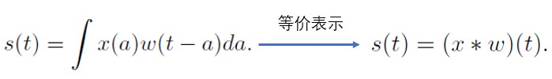

&nbsp;&nbsp;&nbsp;&nbsp;&nbsp;&nbsp;&nbsp;&nbsp;卷积的第一个参数（在这个例子中，函数x）通常叫做**输入（input）**，第二个参数（函数w）叫做**核函数（kernel function）**。输出有时被称作**特征映射或特征图（feature map）**。 
*(核函数、kernel、滤波器、conv的权重 其实所说的都是 w）*  

- 工程中处理的数据大都是离散的，离散的卷积公式如下： 
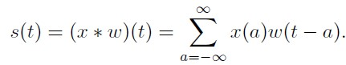

- 工程上大多数据都是多维度的，多维离散的卷积公式演变如下： 
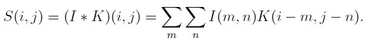

- 卷积是可交换的(commutative)，等价变换如下： 
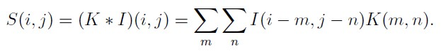

- 转化为更容易理解的形式（互相关函数形式）： 
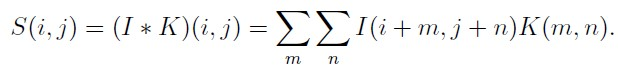

&nbsp;&nbsp;&nbsp;&nbsp;&nbsp;&nbsp;&nbsp;&nbsp;许多机器学习的库实现的是互相关函数但是称之为卷积，在这本书中我们遵循把两种运算都叫做卷积的这个传统，我们最终工程上使用的就是上式。 

- 卷积的计算图： 
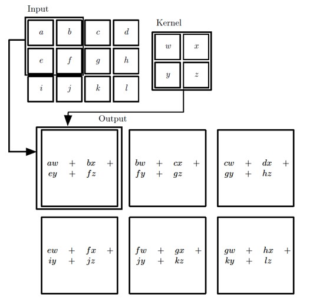

- 卷积运算动态图： 

# 3 体会卷积的作用
- 用卷积提取特征： 
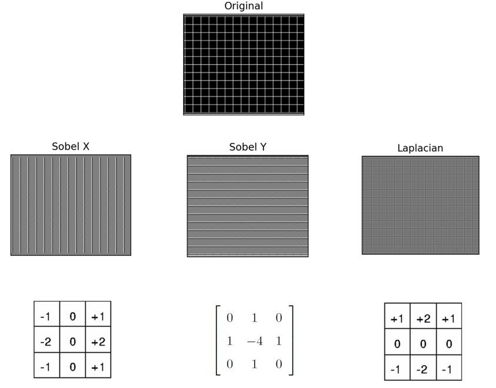

# 4 卷积 和 前馈神经网络的关系
&nbsp;&nbsp;&nbsp;&nbsp;&nbsp;&nbsp;&nbsp;&nbsp;传统的神经网络使用矩阵乘法来建立输入与输出的连接关系。其中，参数矩阵中每一个单独的参数都描述了一个输入单元与一个输出单元间的交互。卷积运算通过三个重要的思想来帮助改进机器学习系统： 稀疏交互（sparse interactions）、参数共享（parameter sharing）、等变表示（equivariant representations）。 

- 稀疏连接  
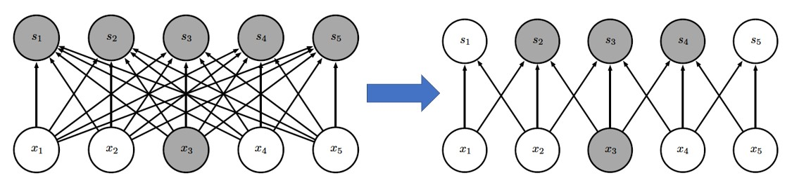

- 权重共享  
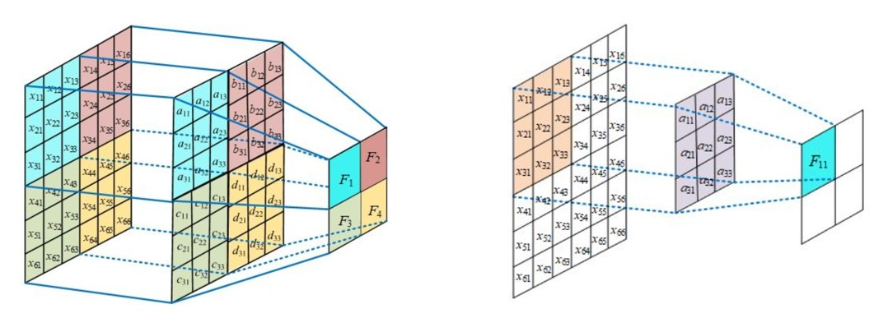

- 等变表示  
&nbsp;&nbsp;&nbsp;&nbsp;&nbsp;&nbsp;&nbsp;&nbsp;如果一个函数满足输入改变，输出也以同样的方式改变这一性质，我们就说它是等变(equivariant) 的，对于卷积，参数共享的特殊形式使得神经网络层具有对平移等变（equivariance）的性质。 

**结论：卷积 是 前馈神经网络的一种特例**  

# 5 工程上标准的卷积

**思考：卷积中 input 张量 和 kernel 张量 分别是几维的？**  
- 通道的概念：
&nbsp;&nbsp;&nbsp;&nbsp;&nbsp;&nbsp;&nbsp;&nbsp;在输入张量中，通道表示不同的特征图（Feature Map），每个特征图对应网络在输入数据中提取的一种特征。 

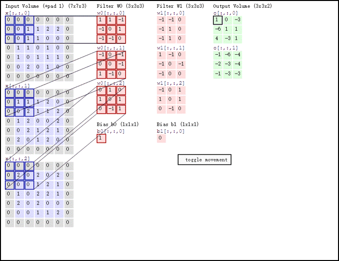

- 哪个是输入？其通道数：
- 哪个是输出？其通道数：
- 哪个是kernel？ 有几个kernel？kernel的通道数：
- 一个输出特征点需要多少输入数据和kernel参与运算，计算规则又是怎样的？
- 工程上 输入、kernel、和输出 数据（Tensor）是几维的？？？
- 输入、输出、和 kernel 之间形状有何关系？？？这种关系能否用公式来表达？
- 输入中最外层0是什么，为什么？
- kernel 滑动时的步长？
- 图示卷积是conv2d 还是 conv3d？
- 图示卷积相对于MLP 是增大了计算量还是减小了计算量？

- padding 图示  

- shape 关系总结如下：  
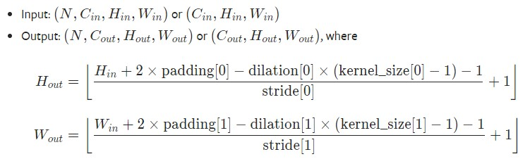

# 6 1x1 卷积
&nbsp;&nbsp;&nbsp;&nbsp;&nbsp;&nbsp;&nbsp;&nbsp;卷积核尺寸为 1x1 时的卷积，也即卷积核变成只有一个数字，1x1 卷积的作用在于能有效地减少维度，降低计算的复杂度.如下图所示： 
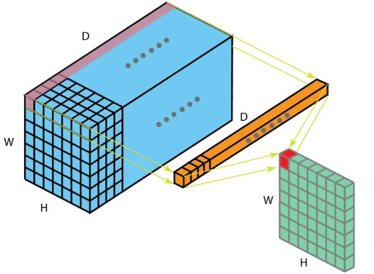

# 7 分组卷积(group convolution)
&nbsp;&nbsp;&nbsp;&nbsp;&nbsp;&nbsp;&nbsp;&nbsp;2012 年，AlexNet 论文中最先提出来的概念，当时主要为了解决 GPU 显存不足问题. 
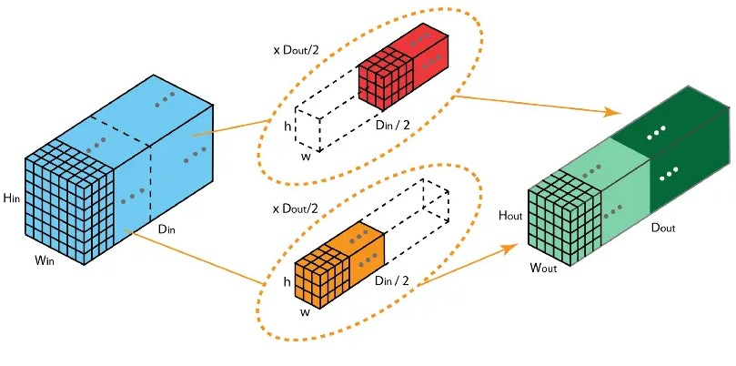

&nbsp;&nbsp;&nbsp;&nbsp;&nbsp;&nbsp;&nbsp;&nbsp;卷积核被分成不同的组，每组负责对相应的输入层进行卷积计算，最后再进行合并。如上图，卷积核被分成前后两个组，前半部分的卷积组负责处理前半部分的输入层，后半部分的卷积组负责处理后半部分的输入层，最后将结果合并组合。 

**思考？？？**
- input 对那个维度分组；
- kernel 对那个维度分组；
- input 和 kernel的shape 有何联系；
- output 的形状如何推导；

# 8 深度可分离卷积（deepwise convolution）
&nbsp;&nbsp;&nbsp;&nbsp;&nbsp;&nbsp;&nbsp;&nbsp;深度可分离卷积由两步组成：深度卷积和 1x1 卷积。首先，在输入层上应用深度卷积。如下图，使用 3 个卷积核分别对输入层的 3 个通道作卷积计算，再堆叠在一起。 
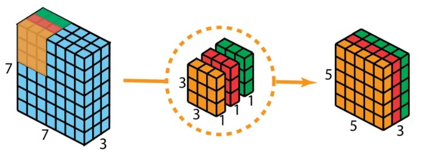

&nbsp;&nbsp;&nbsp;&nbsp;&nbsp;&nbsp;&nbsp;&nbsp;再使用 1x1 的卷积（3 个通道）进行计算，得到只有 1 个通道的结果. 
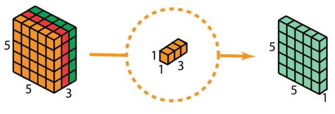

&nbsp;&nbsp;&nbsp;&nbsp;&nbsp;&nbsp;&nbsp;&nbsp;重复多次 1x1 的卷积操作（如下图为 128 次），则最后便会得到一个深度的卷积结果。 
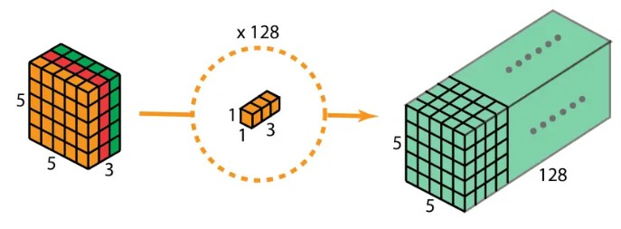

# 9 空间可分离卷积（Spatially Separable Convolutions）
&nbsp;&nbsp;&nbsp;&nbsp;&nbsp;&nbsp;&nbsp;&nbsp;空间可分离卷积是将卷积核分解为两项独立的核分别进行操作。一个 3x3 的卷积核分解如下图： 
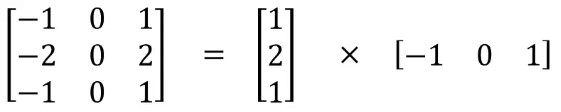

&nbsp;&nbsp;&nbsp;&nbsp;&nbsp;&nbsp;&nbsp;&nbsp;分解后的卷积计算过程如下图，先用 3x1 的卷积核作横向扫描计算，再用 1x3 的卷积核作纵向扫描计算，最后得到结果。采用可分离卷积的计算量比标准卷积要少。 
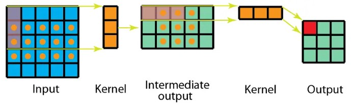

# 10 空洞卷积（膨胀卷积）（Dilated Convolution / Atrous Convolution）
&nbsp;&nbsp;&nbsp;&nbsp;&nbsp;&nbsp;&nbsp;&nbsp;为扩大感受野，在卷积核里面的元素之间插入空格来 “膨胀” 内核，形成 “空洞卷积”（或称膨胀卷积），并用膨胀率参数 L 表示要扩大内核的范围，即在内核元素之间插入 L-1 个空格。当 L=1 时，则内核元素之间没有插入空格，变为标准卷积。如下图为膨胀率 L=2 的空洞卷积： 

- 不同参数L 图如下： 
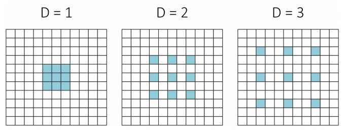

# 11 反卷积（转置卷积)(Deconvolution / Transposed Convolution）
&nbsp;&nbsp;&nbsp;&nbsp;&nbsp;&nbsp;&nbsp;&nbsp;卷积是对输入图像提取出特征（可能尺寸会变小），而所谓的 “反卷积” 便是进行相反的操作。但这里说是 “反卷积” 并不严谨，因为并不会完全还原到跟输入图像一样，一般是还原后的尺寸与输入图像一致，主要用于向上采样。 
*(注解：从数学计算上，“反卷积” 相当于是将卷积核转换为稀疏矩阵后, 通过将卷积核进行翻转（旋转180度）和填充，之后再进行卷积来实现，因此，有时也被称为转置卷积。）*

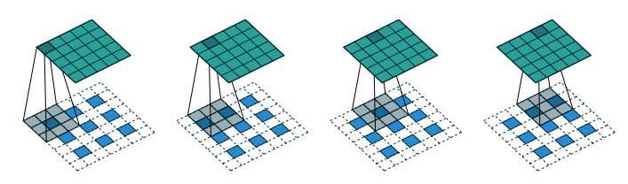

- 动态图为： 
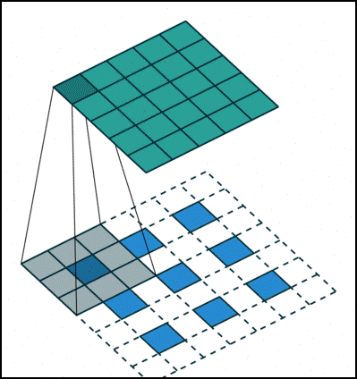

# 12 可变形卷积（deformable convolution）
## 12.1 原理
- 普通卷积网络kernel大小固定，限制了网络几何变换建模的能力;
- 可变形卷积在kernel中加入偏移量offset，能够减轻这种限制，偏移通过输入特征卷积得到;
eg：X.Shape : torch.size([32,64,28,28])   offset.shape : torch.size([32,18,28,28])

## 12.2 过程
- 计算原理图  
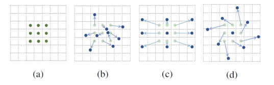

- 卷积过程  
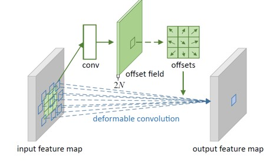

- 整体完善图  
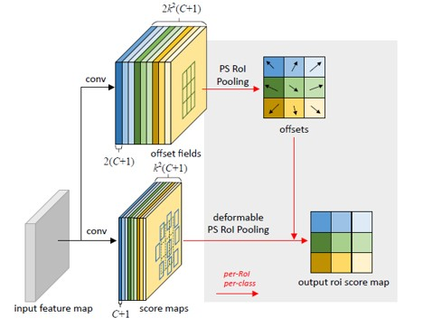

# 13 3D 卷积
&nbsp;&nbsp;&nbsp;&nbsp;&nbsp;&nbsp;&nbsp;&nbsp;3D卷积核有三个维度（高度、宽度、通道），沿着输入图像的 3 个方向进行滑动。 
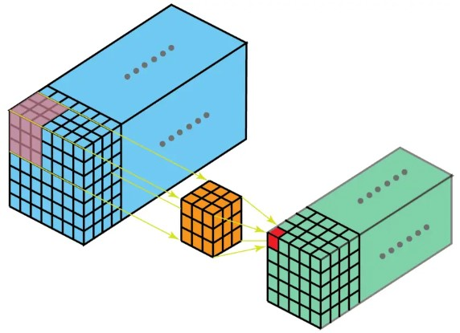

**思考：工程上3D卷积 input 和weight 分别是 多少维的？？？**  
**思考：1D 卷积的情况呢？**

# 14 参考链接
[参考文献](https://arxiv.org/pdf/1603.07285.pdf)
