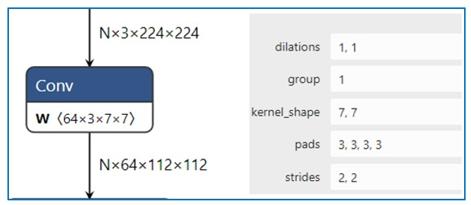
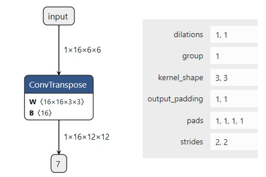
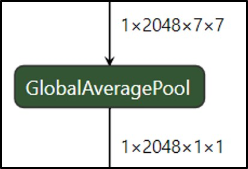

# 1 深度学习模型认识
- [深度学习预训练模型下载](https://github.com/onnx/models)
- [深度学习模型可视化](https://netron.app/)

# 2 深度学习常用算子
## 2.1 Convolution
## 2.1.1 Conv2D
- 示意图<br>


- [pytorch 实现](https://pytorch.org/docs/stable/generated/torch.nn.Conv2d.html#torch.nn.Conv2d)
```python
# With square kernels and equal stride
m = nn.Conv2d(16, 33, 3, stride=2)
# non-square kernels and unequal stride and with padding
m = nn.Conv2d(16, 33, (3, 5), stride=(2, 1), padding=(4, 2))
# non-square kernels and unequal stride and with padding and dilation
m = nn.Conv2d(16, 33, (3, 5), stride=(2, 1), padding=(4, 2), dilation=(3, 1))
input = torch.randn(20, 16, 50, 100)
output = m(input)
```
## 2.1.2 ConvTranspose2d
- 图示 <br>


- [pytorch 实现](https://pytorch.org/docs/stable/generated/torch.nn.ConvTranspose2d.html#torch.nn.ConvTranspose2d)

```python
import torch
import torch.nn as nn
# With square kernels and equal stride
m = nn.ConvTranspose2d(16, 33, 3, stride=2)
# non-square kernels and unequal stride and with padding
m = nn.ConvTranspose2d(16, 33, (3, 5), stride=(2, 1), padding=(4, 2))
input = torch.randn(20, 16, 50, 100)
output = m(input)
# exact output size can be also specified as an argument
input = torch.randn(1, 16, 12, 12)
downsample = nn.Conv2d(16, 16, 3, stride=2, padding=1)
upsample = nn.ConvTranspose2d(16, 16, 3, stride=2, padding=1)
h = downsample(input)
h.size()

output = upsample(h, output_size=input.size())
output.size()
```

## 2.2 Normalization


### 2.2.1 BatchNorm2d
**示意图**


**原理:** <br>
- batchNorm是在batch上，对NHW做归一化;即是将同一个batch中的所有样本的同一层特征图抽出来一起求mean和variance。<br>
- 但是当batch size较小时(小于16时)，效果会变差，这时使用group norm可能得到的效果会更好;
- 加入缩放和平移变量，改变数据分布的均值和方差；

**作用**：<br>
- 首先，在进行训练之前，一般要对数据做归一化，使其分布一致,防止因输入数据分布变化对结果产生影响；
- 其次在网络中间，使用Batchnorm，将数据拉回到正态分布，加快收敛速度，防止梯度消失；
- 加入缩放和平移变量的原因是：保证每一次数据经过归一化后还保留原有学习来的特征，同时又能完成归一化操作，加速训练。 这两个参数是用来学习的参数。

**思考：在训练和推理时有何不同？？？**

- [pytorch 实现](https://pytorch.org/docs/stable/generated/torch.nn.BatchNorm2d.html#torch.nn.BatchNorm2d)
```python
# With Learnable Parameters
m = nn.BatchNorm2d(100)
# Without Learnable Parameters
m = nn.BatchNorm2d(100, affine=False)
input = torch.randn(20, 100, 35, 45)
output = m(input)
```

**手动实现** <br>
```python
import numpy as np
def Batchnorm(x, gamma, beta, bn_param):
    # x_shape:[B, C, H, W]
    running_mean = bn_param['running_mean']
    running_var = bn_param['running_var']
    results = 0.
    eps = 1e-5

    x_mean = np.mean(x, axis=(0, 2, 3), keepdims=True)
    x_var = np.var(x, axis=(0, 2, 3), keepdims=True0)
    x_normalized = (x - x_mean) / np.sqrt(x_var + eps)
    results = gamma * x_normalized + beta

    # 因为在测试时是单个图片测试，这里保留训练时的均值和方差，用在后面测试时用
    running_mean = momentum * running_mean + (1 - momentum) * x_mean
    running_var = momentum * running_var + (1 - momentum) * x_var

    bn_param['running_mean'] = running_mean
    bn_param['running_var'] = running_var

    return results, bn_param
```

- [论文链接](https://arxiv.org/pdf/1502.03167.pdf)

## 2.2.2 LayerNorm
- BN不适用于深度不固定的网络（如 RNN 中的sequence长度），而LayerNorm对深度网络的某一层的所有神经元进行标准化操作，非常适合用于序列化输入。<br>
- LN一般只用于RNN的场景下，在CNN中LN规范化效果不如BN,GN,IN。

**BN 和 LN 的区别**
1. LN中同层神经元输入拥有相同的均值和方差，不同的输入样本有不同的均值和方差；
2. BN中则针对不同神经元输入计算均值和方差，同一个batch中的输入拥有相同的均值和方差。
3. 所以，LN不依赖于batch的大小和输入sequence的深度，因此可以用于batchsize为1和RNN中对边长的输入sequence的normalize操作。
   
- [pytorch 连接](https://pytorch.org/docs/stable/generated/torch.nn.LayerNorm.html#torch.nn.LayerNorm)
```python
batch, sentence_length, embedding_dim = 20, 5, 10
embedding = torch.randn(batch, sentence_length, embedding_dim)
layer_norm = nn.LayerNorm(embedding_dim)
# Activate module
output = layer_norm(embedding)
```

**手动实现**
```python
def ln(x, b, s):
    _eps = 1e-5
    output = (x - x.mean(1)[:,None]) / tensor.sqrt((x.var(1)[:,None] + _eps))
    output = s[None, :] * output + b[None,:]
    return output

# 用于图像上
def Layernorm(x, gamma, beta):
    # x_shape:[B, C, H, W]
    results = 0.
    eps = 1e-5

    x_mean = np.mean(x, axis=(1, 2, 3), keepdims=True)
    x_var = np.var(x, axis=(1, 2, 3), keepdims=True0)
    x_normalized = (x - x_mean) / np.sqrt(x_var + eps)
    results = gamma * x_normalized + beta
    return results
```

- [论文链接](https://arxiv.org/pdf/1607.06450v1.pdf)

### 2.2.3 Instance Normalization
- BN注重对每个batch进行归一化，保证数据分布一致，因为判别模型中结果取决于数据整体分布。
- 但是图像风格化中，生成结果主要依赖于某个图像实例，所以对整个batch归一化不适合图像风格化中，因而对HW做归一化。可以加速模型收敛，并且保持每个图像实例之间的独立。

- [pytorch 链接](https://pytorch.org/docs/stable/generated/torch.nn.InstanceNorm2d.html#torch.nn.InstanceNorm2d)
```python
# Without Learnable Parameters
m = nn.InstanceNorm2d(100)
# With Learnable Parameters
m = nn.InstanceNorm2d(100, affine=True)
input = torch.randn(20, 100, 35, 45)
output = m(input)
```

**手动实现** <br>
```python
def Instancenorm(x, gamma, beta):
    # x_shape:[B, C, H, W]
    results = 0.
    eps = 1e-5

    x_mean = np.mean(x, axis=(2, 3), keepdims=True)
    x_var = np.var(x, axis=(2, 3), keepdims=True0)
    x_normalized = (x - x_mean) / np.sqrt(x_var + eps)
    results = gamma * x_normalized + beta
    return results
```
[Instance 论文链接](https://arxiv.org/pdf/1607.08022.pdf)

## 2.2.4 
- 主要是针对Batch Normalization对小batchsize效果差，GN将channel方向分group，然后每个group内做归一化，算(C//G)*H*W的均值，这样与batchsize无关，不受其约束。<br>

[pytorch 实现](https://pytorch.org/docs/stable/generated/torch.nn.GroupNorm.html#torch.nn.GroupNorm)
```python
input = torch.randn(20, 6, 10, 10)
# Separate 6 channels into 3 groups
m = nn.GroupNorm(3, 6)
# Separate 6 channels into 6 groups (equivalent with InstanceNorm)
m = nn.GroupNorm(6, 6)
# Put all 6 channels into a single group (equivalent with LayerNorm)
m = nn.GroupNorm(1, 6)
# Activating the module
output = m(input)
```

**手动实现**
```python
def GroupNorm(x, gamma, beta, G=16):
    # x_shape:[B, C, H, W]
    results = 0.
    eps = 1e-5
    x = np.reshape(x, (x.shape[0], G, x.shape[1]/16, x.shape[2], x.shape[3]))

    x_mean = np.mean(x, axis=(2, 3, 4), keepdims=True)
    x_var = np.var(x, axis=(2, 3, 4), keepdims=True0)
    x_normalized = (x - x_mean) / np.sqrt(x_var + eps)
    results = gamma * x_normalized + beta
    return results
```

## 2.3 Pooling
Pooling(池化)是CNN 中常用的操作，通过在特定区域内对特征进行(reduce)来实现的。

**作用**
- 增大网络感受野
- 减小特征图尺寸，但保留重要的特征信息
- 抑制噪声，降低信息冗余
- 降低模型计算量，降低网络优化难度，防止网络过拟合
- 使模型对输入图像中的特征位置变化更加鲁棒

### 2.3.1 Max Pooling
最大池化在每个池化窗口中选择最大的特征值作为输出，提取特征图中响应最强烈的部分进入下一层，这种方式摒弃了网络中大量的冗余信息，使得网络更容易被优化。同时这种操作方式也常常丢失了一些特征图中的细节信息，所以最大池化更多保留些图像的纹理信息。<br>


### 2.3.2 AveragePooling
平均池化在每个池化窗口中选择特征值的平均值作为输出，这有助于保留整体特征信息，可以更多的保留图像的背景信息，但可能会丢失一些细节。

[pytorch 实现](https://pytorch.org/docs/stable/generated/torch.nn.AvgPool2d.html#torch.nn.AvgPool2d)
```python
# pool of square window of size=3, stride=2
m = nn.AvgPool2d(3, stride=2)
# pool of non-square window
m = nn.AvgPool2d((3, 2), stride=(2, 1))
input = torch.randn(20, 16, 50, 32)
output = m(input)
```

### 2.3.3 Global Average Pooling


**背景** <br>
在卷积神经网络训练初期，卷积层通过池化层后一般要接多个全连接层进行降维，最后再Softmax分类，这种做法使得全连接层参数很多，降低了网络训练速度，且容易出现过拟合的情况。在这种背景下，M Lin等人提出使用全局平均池化Global Average Pooling[1]来取代最后的全连接层。用很小的计算代价实现了降维，更重要的是GAP极大减少了网络参数(CNN网络中全连接层占据了很大的参数)。<br>

**实现原理** <br>
全局平均池化是在整个特征图上计算特征值的平均值，然后将结果作为一个特征向量输出到下一层，这种池化方法通常在网络最后。

**作用**
作为全连接层的替代操作，GAP对整个网络在结构上做正则化防止过拟合，直接剔除了全连接层中黑箱的特征，直接赋予了每个channel实际的类别意义。除此之外，使用GAP代替全连接层，可以实现任意图像大小的输入，而GAP对整个特征图求平均值，也可以用来提取全局上下文信息，全局信息作为指导进一步增强网络性能。

[pytorch 实现](https://pytorch.org/docs/stable/generated/torch.nn.AdaptiveAvgPool2d.html#torch.nn.AdaptiveAvgPool2d)
```python
# target output size of 5x7
m = nn.AdaptiveAvgPool2d((5, 7))
input = torch.randn(1, 64, 8, 9)
output = m(input)
# target output size of 7x7 (square)
m = nn.AdaptiveAvgPool2d(7)
input = torch.randn(1, 64, 10, 9)
output = m(input)
# target output size of 10x7
m = nn.AdaptiveAvgPool2d((None, 7))
input = torch.randn(1, 64, 10, 9)
output = m(input)
```
- [avgpool 论文链接](https://arxiv.org/pdf/1312.4400.pdf%20http://arxiv.org/abs/1312.4400.pdf)

# 附录
- [onnx 算子列表](https://github.com/onnx/onnx/blob/main/docs/Operators.md)
- [pytorch 算子列表](https://pytorch.org/docs/stable/nn.html)


  
