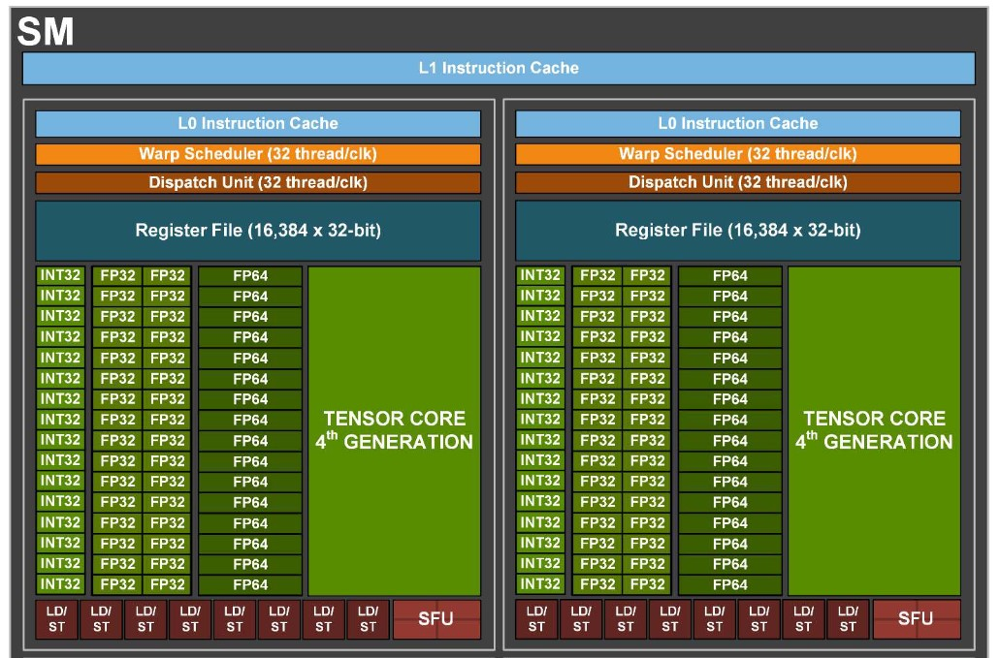

# 1 pytorch 官网

  
# 2 pytorch 简介
## 2.1 认识pytorch
- [nvidia- pytorch](https://www.nvidia.cn/glossary/data-science/pytorch/)

## 2.2 pytorch 软件栈

# 3 pytorch install
- [安装最新版本](https://pytorch.org/)

- [安装指定版本](https://pytorch.org/get-started/previous-versions/)

# 4 nvidia 相关软件库
## 4.1 显卡驱动
&nbsp;&nbsp;&nbsp;&nbsp;&nbsp;&nbsp;&nbsp;&nbsp;显卡驱动的作用就是用来驱动显卡的，这是电脑硬件中所对应的一个软件。通过添加驱动程序计算机中的硬件就能正常的工作，当然不同的硬件使用的驱动程序也不一样。显卡对应的就是显卡驱动。 

- [nvidia driver](https://www.nvidia.cn/Download/Find.aspx?lang=cn)

## 4.2 cuda
&nbsp;&nbsp;&nbsp;&nbsp;&nbsp;&nbsp;&nbsp;&nbsp;统一计算设备架构（Compute Unified Device Architecture, CUDA），是由NVIDIA推出的通用并行计算架构。解决的是用更加廉价的设备资源，实现更高效的并行计算。 和中央处理器（Central Processing Unit, CPU）相对，图形处理器（Graphics Processing Unit, GPU）是显卡的核心芯片。而cuda正是英伟达开发的GPU的编程接口！ 

- [cuda download](https://developer.nvidia.com/cuda-toolkit-archive)

## 4.3 cudnn
&nbsp;&nbsp;&nbsp;&nbsp;&nbsp;&nbsp;&nbsp;&nbsp;cuDNN（CUDA Deep Neural Network library）：是NVIDIA打造的针对深度神经网络的加速库，是一个用于深层神经网络的GPU加速库。.如果你要用GPU训练模型，cuDNN不是必须的，但是一般会采用这个加速库。总结来说，CPU适合串行计算，擅长逻辑控制。GPU擅长并行高强度并行计算，适用于AI算法的训练学习！ 

- [cudnn download](https://developer.nvidia.com/rdp/cudnn-archive)

# 5 GPU 
## 5.1 GPU 加速原理

## 5.2 最先进的GPU
- [H100](https://resources.nvidia.com/en-us-tensor-core)
- [A100](https://www.nvidia.com/content/dam/en-zz/Solutions/Data-Center/HGX/a100-80gb-hgx-a100-datasheet-us-nvidia-1485640-r6-web.pdf)
