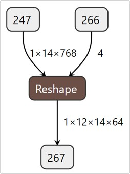
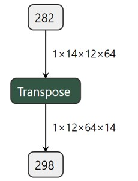

# 1 Convolution
## 1.1 Conv2D
- 示意图<br>


- [pytorch 实现](https://pytorch.org/docs/stable/generated/torch.nn.Conv2d.html#torch.nn.Conv2d)
```python
import torch.nn as nn
# With square kernels and equal stride
m = nn.Conv2d(16, 33, 3, stride=2)
# non-square kernels and unequal stride and with padding
m = nn.Conv2d(16, 33, (3, 5), stride=(2, 1), padding=(4, 2))
# non-square kernels and unequal stride and with padding and dilation
m = nn.Conv2d(16, 33, (3, 5), stride=(2, 1), padding=(4, 2), dilation=(3, 1))
input = torch.randn(20, 16, 50, 100)
output = m(input)
```

## 1.2 ConvTranspose2d
- 图示 <br>


- [pytorch 实现](https://pytorch.org/docs/stable/generated/torch.nn.ConvTranspose2d.html#torch.nn.ConvTranspose2d)

```python
import torch
import torch.nn as nn
# With square kernels and equal stride
m = nn.ConvTranspose2d(16, 33, 3, stride=2)
# non-square kernels and unequal stride and with padding
m = nn.ConvTranspose2d(16, 33, (3, 5), stride=(2, 1), padding=(4, 2))
input = torch.randn(20, 16, 50, 100)
output = m(input)
# exact output size can be also specified as an argument
input = torch.randn(1, 16, 12, 12)
downsample = nn.Conv2d(16, 16, 3, stride=2, padding=1)
upsample = nn.ConvTranspose2d(16, 16, 3, stride=2, padding=1)
h = downsample(input)
h.size()

output = upsample(h, output_size=input.size())
output.size()
```

# 2 线性变换层
## 2.1 Linear/Gemm
**图示** <br>


- [pytorch 实现](https://pytorch.org/docs/stable/generated/torch.nn.Linear.html#torch.nn.Linear)
```python
import torch.nn as nn
m = nn.Linear(20, 30)
input = torch.randn(128, 20)
output = m(input)
print(output.size())
```

## 2.2 matmul 相关
**图示** <br>


**pytorch中有三个相似的矩阵操作** <br>
- matmul是通用的矩阵乘法函数，适用于不同维度的输入。
- bmm是用于批量矩阵乘法的函数，要求输入为3维张量。
- mm是用于两个二维矩阵乘法的函数，要求输入为2维张量。

```python
import torch
tensor1 = torch.randn(10, 3, 4)
tensor2 = torch.randn(10, 4, 5)
torch.matmul(tensor1, tensor2).size()

mat1 = torch.randn(2, 3)
mat2 = torch.randn(3, 3)
torch.mm(mat1, mat2)

input = torch.randn(10, 3, 4)
mat2 = torch.randn(10, 4, 5)
res = torch.bmm(input, mat2)
res.size()
```

# 3 Normalization
**几种Normalization 对比** <br>


##  3.1 BatchNorm2d
**BN示意图** <br>


**原理:** <br>
- batchNorm是在batch上，对NHW做归一化;即是将同一个batch中的所有样本的同一层特征图抽出来一起求mean和variance。<br>
- 但是当batch size较小时(小于16时)，效果会变差，这时使用group norm可能得到的效果会更好;
- 加入缩放和平移变量，改变数据分布的均值和方差；

**作用**：<br>
- 首先，在进行训练之前，一般要对数据做归一化，使其分布一致,防止因输入数据分布变化对结果产生影响；
- 其次在网络中间，使用Batchnorm，将数据拉回到正态分布，加快收敛速度，防止梯度消失；
- 加入缩放和平移变量的原因是：保证每一次数据经过归一化后还保留原有学习来的特征，同时又能完成归一化操作，加速训练。 这两个参数是用来学习的参数。

**思考：在训练和推理时有何不同？？？**

- [pytorch 实现](https://pytorch.org/docs/stable/generated/torch.nn.BatchNorm2d.html#torch.nn.BatchNorm2d)
```python
# With Learnable Parameters
m = nn.BatchNorm2d(100)
# Without Learnable Parameters
m = nn.BatchNorm2d(100, affine=False)
input = torch.randn(20, 100, 35, 45)
output = m(input)
```

**手动实现** <br>
```python
import numpy as np
def Batchnorm(x, gamma, beta, bn_param):
    # x_shape:[B, C, H, W]
    running_mean = bn_param['running_mean']
    running_var = bn_param['running_var']
    results = 0.
    eps = 1e-5

    x_mean = np.mean(x, axis=(0, 2, 3), keepdims=True)
    x_var = np.var(x, axis=(0, 2, 3), keepdims=True0)
    x_normalized = (x - x_mean) / np.sqrt(x_var + eps)
    results = gamma * x_normalized + beta

    # 因为在测试时是单个图片测试，这里保留训练时的均值和方差，用在后面测试时用
    running_mean = momentum * running_mean + (1 - momentum) * x_mean
    running_var = momentum * running_var + (1 - momentum) * x_var

    bn_param['running_mean'] = running_mean
    bn_param['running_var'] = running_var

    return results, bn_param
```

- [论文链接](https://arxiv.org/pdf/1502.03167.pdf)

## 3.2 LayerNorm
**LN 简述** <br>
- BN不适用于深度不固定的网络（如 RNN 中的sequence长度），而LayerNorm对深度网络的某一层的所有神经元进行标准化操作，非常适合用于序列化输入。<br>
- LN一般只用于RNN的场景下，在CNN中LN规范化效果不如BN,GN,IN。

**BN 和 LN 的区别** <br>
1. LN中同层神经元输入拥有相同的均值和方差，不同的输入样本有不同的均值和方差；
2. BN中则针对不同神经元输入计算均值和方差，同一个batch中的输入拥有相同的均值和方差。
3. 所以，LN不依赖于batch的大小和输入sequence的深度，因此可以用于batchsize为1和RNN中对边长的输入sequence的normalize操作。
   
- [pytorch 实现](https://pytorch.org/docs/stable/generated/torch.nn.LayerNorm.html#torch.nn.LayerNorm)
```python
import torch
import torch.nn as nn
batch, sentence_length, embedding_dim = 20, 5, 10
embedding = torch.randn(batch, sentence_length, embedding_dim)
layer_norm = nn.LayerNorm(embedding_dim)
# Activate module
output = layer_norm(embedding)
```

**手动实现** <br>
```python
def ln(x, b, s):
    _eps = 1e-5
    output = (x - x.mean(1)[:,None]) / tensor.sqrt((x.var(1)[:,None] + _eps))
    output = s[None, :] * output + b[None,:]
    return output

# 用于图像上
def Layernorm(x, gamma, beta):
    # x_shape:[B, C, H, W]
    results = 0.
    eps = 1e-5

    x_mean = np.mean(x, axis=(1, 2, 3), keepdims=True)
    x_var = np.var(x, axis=(1, 2, 3), keepdims=True0)
    x_normalized = (x - x_mean) / np.sqrt(x_var + eps)
    results = gamma * x_normalized + beta
    return results
```

- [论文链接](https://arxiv.org/pdf/1607.06450v1.pdf)

## 3.3 Instance Normalization
**简述** <br>
- BN注重对每个batch进行归一化，保证数据分布一致，因为判别模型中结果取决于数据整体分布。
- 但是图像风格化中，生成结果主要依赖于某个图像实例，所以对整个batch归一化不适合图像风格化中，因而对HW做归一化。可以加速模型收敛，并且保持每个图像实例之间的独立。

- [pytorch 实现](https://pytorch.org/docs/stable/generated/torch.nn.InstanceNorm2d.html#torch.nn.InstanceNorm2d)
```python
# Without Learnable Parameters
m = nn.InstanceNorm2d(100)
# With Learnable Parameters
m = nn.InstanceNorm2d(100, affine=True)
input = torch.randn(20, 100, 35, 45)
output = m(input)
```

**手动实现** <br>
```python
def Instancenorm(x, gamma, beta):
    # x_shape:[B, C, H, W]
    results = 0.
    eps = 1e-5

    x_mean = np.mean(x, axis=(2, 3), keepdims=True)
    x_var = np.var(x, axis=(2, 3), keepdims=True0)
    x_normalized = (x - x_mean) / np.sqrt(x_var + eps)
    results = gamma * x_normalized + beta
    return results
```
- [Instance 论文链接](https://arxiv.org/pdf/1607.08022.pdf)

## 3.4  Group Normalization
**原理** <br>
&nbsp;&nbsp;&nbsp;&nbsp;&nbsp;&nbsp;&nbsp;&nbsp;主要是针对Batch Normalization对小batchsize效果差，GN将channel方向分group，然后每个group内做归一化，算(C//G)*H*W的均值，这样与batchsize无关，不受其约束。<br>

- [pytorch 实现](https://pytorch.org/docs/stable/generated/torch.nn.GroupNorm.html#torch.nn.GroupNorm)
```python
input = torch.randn(20, 6, 10, 10)
# Separate 6 channels into 3 groups
m = nn.GroupNorm(3, 6)
# Separate 6 channels into 6 groups (equivalent with InstanceNorm)
m = nn.GroupNorm(6, 6)
# Put all 6 channels into a single group (equivalent with LayerNorm)
m = nn.GroupNorm(1, 6)
# Activating the module
output = m(input)
```

**手动实现** <br>
```python
def GroupNorm(x, gamma, beta, G=16):
    # x_shape:[B, C, H, W]
    results = 0.
    eps = 1e-5
    x = np.reshape(x, (x.shape[0], G, x.shape[1]/16, x.shape[2], x.shape[3]))

    x_mean = np.mean(x, axis=(2, 3, 4), keepdims=True)
    x_var = np.var(x, axis=(2, 3, 4), keepdims=True0)
    x_normalized = (x - x_mean) / np.sqrt(x_var + eps)
    results = gamma * x_normalized + beta
    return results
```

# 4 Pooling
&nbsp;&nbsp;&nbsp;&nbsp;&nbsp;&nbsp;&nbsp;&nbsp;Pooling(池化)是CNN 中常用的操作，通过在特定区域内对特征进行(reduce)来实现的。<br>

**作用** <br>
- 增大网络感受野
- 减小特征图尺寸，但保留重要的特征信息
- 抑制噪声，降低信息冗余
- 降低模型计算量，降低网络优化难度，防止网络过拟合
- 使模型对输入图像中的特征位置变化更加鲁棒

## 4.1 Max Pooling
**原理** <br>
&nbsp;&nbsp;&nbsp;&nbsp;&nbsp;&nbsp;&nbsp;&nbsp;最大池化在每个池化窗口中选择最大的特征值作为输出，提取特征图中响应最强烈的部分进入下一层; <br>


**作用** <br>
&nbsp;&nbsp;&nbsp;&nbsp;&nbsp;&nbsp;&nbsp;&nbsp;这种方式摒弃了网络中大量的冗余信息，使得网络更容易被优化。同时这种操作方式也常常丢失了一些特征图中的细节信息，所以最大池化更多保留些图像的纹理信息。<br>

- [pytorch 实现](https://pytorch.org/docs/stable/generated/torch.nn.MaxPool2d.html#torch.nn.MaxPool2d)
```python
import torch.nn as nn
# pool of square window of size=3, stride=2
m = nn.MaxPool2d(3, stride=2)
# pool of non-square window
m = nn.MaxPool2d((3, 2), stride=(2, 1))
input = torch.randn(20, 16, 50, 32)
output = m(input)
```

## 4.2 AveragePooling
&nbsp;&nbsp;&nbsp;&nbsp;&nbsp;&nbsp;&nbsp;&nbsp;平均池化在每个池化窗口中选择特征值的平均值作为输出，这有助于保留整体特征信息，可以更多的保留图像的背景信息，但可能会丢失一些细节。<br>

- [pytorch 实现](https://pytorch.org/docs/stable/generated/torch.nn.AvgPool2d.html#torch.nn.AvgPool2d)
```python
import torch.nn as nn
# pool of square window of size=3, stride=2
m = nn.AvgPool2d(3, stride=2)
# pool of non-square window
m = nn.AvgPool2d((3, 2), stride=(2, 1))
input = torch.randn(20, 16, 50, 32)
output = m(input)
```

## 4.3 Global Average Pooling


**背景** <br>
&nbsp;&nbsp;&nbsp;&nbsp;&nbsp;&nbsp;&nbsp;&nbsp;在卷积神经网络训练初期，卷积层通过池化层后一般要接多个全连接层进行降维，最后再Softmax分类，这种做法使得全连接层参数很多，降低了网络训练速度，且容易出现过拟合的情况。在这种背景下，M Lin等人提出使用全局平均池化Global Average Pooling[1]来取代最后的全连接层。用很小的计算代价实现了降维，更重要的是GAP极大减少了网络参数(CNN网络中全连接层占据了很大的参数)。<br>

**实现原理** <br>
&nbsp;&nbsp;&nbsp;&nbsp;&nbsp;&nbsp;&nbsp;&nbsp;全局平均池化是在整个特征图上计算特征值的平均值，然后将结果作为一个特征向量输出到下一层，这种池化方法通常在网络最后。<br>

**作用** <br>
&nbsp;&nbsp;&nbsp;&nbsp;&nbsp;&nbsp;&nbsp;&nbsp;作为全连接层的替代操作，GAP对整个网络在结构上做正则化防止过拟合，直接剔除了全连接层中黑箱的特征，直接赋予了每个channel实际的类别意义。除此之外，使用GAP代替全连接层，可以实现任意图像大小的输入，而GAP对整个特征图求平均值，也可以用来提取全局上下文信息，全局信息作为指导进一步增强网络性能。<br>

- [pytorch 实现](https://pytorch.org/docs/stable/generated/torch.nn.AdaptiveAvgPool2d.html#torch.nn.AdaptiveAvgPool2d)
```python
import torch
import torch.nn as nn
# target output size of 5x7
m = nn.AdaptiveAvgPool2d((5, 7))
input = torch.randn(1, 64, 8, 9)
output = m(input)
# target output size of 7x7 (square)
m = nn.AdaptiveAvgPool2d(7)
input = torch.randn(1, 64, 10, 9)
output = m(input)
# target output size of 10x7
m = nn.AdaptiveAvgPool2d((None, 7))
input = torch.randn(1, 64, 10, 9)
output = m(input)
```
- [GlobalAvgPool 论文链接](https://arxiv.org/pdf/1312.4400.pdf%20http://arxiv.org/abs/1312.4400.pdf)

# 5 activation functions

- [参考下一课时](../6-activation_functions/activations.md)

# 6 reshape、 view、 permute、transpose
## 6.1 reshape 
&nbsp;&nbsp;&nbsp;&nbsp;&nbsp;&nbsp;&nbsp;&nbsp;返回一个具有与输入相同的数据和元素数量，但具有指定形状的张量。如果可能的话，返回的张量将是输入的视图。否则，它将是一个副本。连续的输入和具有兼容步幅的输入可以进行重塑而无需复制，但您不应依赖于复制与视图行为。<br>



[pytorch reshapes 实现](https://pytorch.org/docs/stable/generated/torch.reshape.html#torch-reshape)
```python
a = torch.arange(4.)
torch.reshape(a, (2, 2))
b = torch.tensor([[0, 1], [2, 3]])
torch.reshape(b, (-1,))
```

## 6.2 view
&nbsp;&nbsp;&nbsp;&nbsp;&nbsp;&nbsp;&nbsp;&nbsp;返回原始数据的不同shape。<br>

- [pytorch 实现](https://pytorch.org/docs/stable/generated/torch.Tensor.view.html#torch.Tensor.view)
```python
x = torch.randn(4, 4)
x.size()
y = x.view(16)
y.size()
z = x.view(-1, 8)  # the size -1 is inferred from other dimensions
z.size()

a = torch.randn(1, 2, 3, 4)
a.size()
b = a.transpose(1, 2)  # Swaps 2nd and 3rd dimension
b.size()
c = a.view(1, 3, 2, 4)  # Does not change tensor layout in memory
c.size()
torch.equal(b, c)
```

## 6.3 transpose
&nbsp;&nbsp;&nbsp;&nbsp;&nbsp;&nbsp;&nbsp;&nbsp;交换Tensor的两个轴并返回。<br>


- [pytorch 实现](https://pytorch.org/docs/stable/generated/torch.transpose.html#torch-transpose)
```python
x = torch.randn(2, 3)
x
torch.transpose(x, 0, 1)
```

## 6.4 permute
&nbsp;&nbsp;&nbsp;&nbsp;&nbsp;&nbsp;&nbsp;&nbsp;tensor 多轴交换。<br>
- [pytorch 实现](https://pytorch.org/docs/stable/generated/torch.permute.html#torch-permute)
```python
x = torch.randn(2, 3, 5)
x.size()
torch.permute(x, (2, 0, 1)).size()
```

# 7 sequenze 和 unequenze
&nbsp;&nbsp;&nbsp;&nbsp;&nbsp;&nbsp;&nbsp;&nbsp;压缩维度与解压维度。<br>

**图像** <br>


# 8 concat、stack、expand 和 flatten
## 8.1 concat
&nbsp;&nbsp;&nbsp;&nbsp;&nbsp;&nbsp;&nbsp;&nbsp;在给定的维度上拼接给定的序列张量。所有张量必须具有相同的形状（除了拼接维度），或者为空。是split 的逆运算，是torch.cat的别名。<br>

- [pytorch 实现](https://pytorch.org/docs/stable/generated/torch.cat.html#torch.cat)
```python
x = torch.randn(2, 3)
torch.cat((x, x, x), 0)
torch.cat((x, x, x), 1)
```
## 8.2 stack
&nbsp;&nbsp;&nbsp;&nbsp;&nbsp;&nbsp;&nbsp;&nbsp;在新轴上拼接Tensor。
```python
a = torch.randn(2,3)
b = torch.randn(2,3)
c= torch.stack([a,b], dim=1)
```

## 8.3 expand
&nbsp;&nbsp;&nbsp;&nbsp;&nbsp;&nbsp;&nbsp;&nbsp;返回一个self张量的新视图，其中的单例维度被扩展到更大的大小。<br>

- [pytorch 实现](https://pytorch.org/docs/stable/generated/torch.Tensor.expand.html)
```python
x = torch.tensor([[1], [2], [3]])
x.size()
x.expand(3, 4)
x.expand(-1, 4)   # -1 means not changing the size of that dimension
```
**思考：expand 后的形状可以随便写吗？需要满足什么规则 ？？？** <br>

## 8.4 flatten
&nbsp;&nbsp;&nbsp;&nbsp;&nbsp;&nbsp;&nbsp;&nbsp;通过将输入张量重塑为一维张量来对其进行扁平化。如果传递了start_dim或end_dim，则只有以start_dim开头且以end_dim结尾的维度被扁平化。输入中元素的顺序保持不变。<br>

- [pytorch 实现](https://pytorch.org/docs/stable/generated/torch.flatten.html#torch-flatten)
```python
t = torch.tensor([[[1, 2],
                   [3, 4]],
                  [[5, 6],
                   [7, 8]]])
torch.flatten(t)
torch.flatten(t, start_dim=1)
```

# 9 pointwise
&nbsp;&nbsp;&nbsp;&nbsp;&nbsp;&nbsp;&nbsp;&nbsp;Tensor 中逐元素进行的操作，也叫element wise 操作，大部分的activation 算子以及 add、sub、mul、div、sqrt 等都属于pointwise 类别。<br>

- [pytorch 实现](https://pytorch.org/docs/stable/generated/torch.sqrt.html#torch.sqrt)
```python
a = torch.randn(4)
torch.sqrt(a)
```
**思考：不同维度的两个Tensor 可以进行pointwise 操作吗？ 能的话规则是什么样的？？？** <br>

# 10 split 和 slice
## 10.1 split
&nbsp;&nbsp;&nbsp;&nbsp;&nbsp;&nbsp;&nbsp;&nbsp;将张量分割成多个块。每个块都是原始张量的视图。<br>
- [pytorch 实现](https://pytorch.org/docs/stable/generated/torch.split.html#torch.split)

```python
a = torch.arange(10).reshape(5, 2)
torch.split(a, 2)
torch.split(a, [1, 4])
```
**思考：是沿着那个轴进行split 呢？？** <br>

## 10.2 slice
**直接用索引来实现** <br>
```python
import torch
# 创建一个示例张量
tensor = torch.tensor([1, 2, 3, 4, 5, 6, 7, 8, 9, 10])
# 对张量进行切片
slice_tensor = tensor[2:7]  # 从索引2到索引6（不包含7）
print(slice_tensor)  # 输出: tensor([3, 4, 5, 6, 7])
# 使用步长对张量进行切片
step_slice_tensor = tensor[1:9:2]  # 从索引1到索引8（不包含9），步长为2
print(step_slice_tensor)  # 输出: tensor([2, 4, 6, 8])
# 省略起始索引和结束索引来选择整个张量
full_tensor = tensor[:]
print(full_tensor)  # 输出: tensor([1, 2, 3, 4, 5, 6, 7, 8, 9, 10])
```

# 11 reduce 规约类算子
**mean** <br>
```python
a = torch.randn(4, 4)
torch.mean(a, 1)
torch.mean(a, 1, True)
```
**var** <br>
```python
a = torch.tensor(
    [[ 0.2035,  1.2959,  1.8101, -0.4644],
     [ 1.5027, -0.3270,  0.5905,  0.6538],
     [-1.5745,  1.3330, -0.5596, -0.6548],
     [ 0.1264, -0.5080,  1.6420,  0.1992]])
torch.var(a, dim=1, keepdim=True)
```
**sum** <br>
```python
a = torch.randn(4, 4)
torch.sum(a, 1)
b = torch.arange(4 * 5 * 6).view(4, 5, 6)
torch.sum(b, (2, 1))
```

**max** <br>
```python
a = torch.randn(4, 4)
torch.max(a, 1)
```

**min** <br>
```python
a = torch.randn(4, 4)
torch.min(a, 1)
```

# 12 embedding
&nbsp;&nbsp;&nbsp;&nbsp;&nbsp;&nbsp;&nbsp;&nbsp;这个模块经常被用来存储单词嵌入，并使用索引来检索它们。该模块的输入是一个索引列表，输出是相应的单词嵌入。<br>

- [pytorch 实现](https://pytorch.org/docs/stable/generated/torch.nn.Embedding.html#torch.nn.Embedding)
```python
# an Embedding module containing 10 tensors of size 3
embedding = nn.Embedding(10, 3)
# a batch of 2 samples of 4 indices each
input = torch.LongTensor([[1, 2, 4, 5], [4, 3, 2, 9]])
embedding(input)

# example with padding_idx
embedding = nn.Embedding(10, 3, padding_idx=0)
input = torch.LongTensor([[0, 2, 0, 5]])
embedding(input)

# example of changing `pad` vector
padding_idx = 0
embedding = nn.Embedding(3, 3, padding_idx=padding_idx)
embedding.weight
with torch.no_grad():
    embedding.weight[padding_idx] = torch.ones(3)
embedding.weight

# FloatTensor containing pretrained weights
weight = torch.FloatTensor([[1, 2.3, 3], [4, 5.1, 6.3]])
embedding = nn.Embedding.from_pretrained(weight)
# Get embeddings for index 1
input = torch.LongTensor([1])
embedding(input)
```

# 13 dropout
&nbsp;&nbsp;&nbsp;&nbsp;&nbsp;&nbsp;&nbsp;&nbsp;在训练过程中，使用从伯努利分布中采样的样本，以概率p随机将输入张量的某些元素置零。每个通道在每次前向调用时都会独立地被置零。<br>

**原理图** <br>


- [pytorch 实现](https://pytorch.org/docs/stable/generated/torch.nn.Dropout.html#torch.nn.Dropout)
```python
m = nn.Dropout(p=0.2)
input = torch.randn(20, 16)
output = m(input)
```

**思考：训练和推理时这个算子表现有何不同 ？？？*** <br>

- [论文链接](https://arxiv.org/abs/1207.0580)

# 14 附录
- [onnx 算子列表](https://github.com/onnx/onnx/blob/main/docs/Operators.md) <br>
- [pytorch 算子列表](https://pytorch.org/docs/stable/nn.html) <br>

# 15 参考链接
- [激活函数汇总](http://spytensor.com/index.php/archives/23/?xqrspi=xnemo1) <br>
- [激活函数综述](https://www.xhuqk.com/xhdxxbzkb/article/doi/10.12198/j.issn.1673-159X.3761) <br>
- [Activation 可视化](https://dashee87.github.io/deep%20learning/visualising-activation-functions-in-neural-networks/) <br>
  
