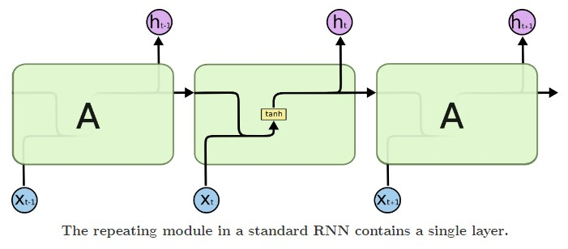
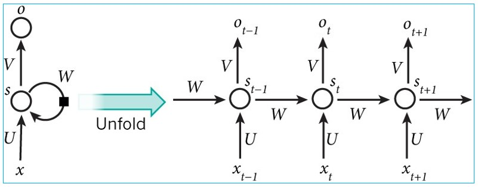
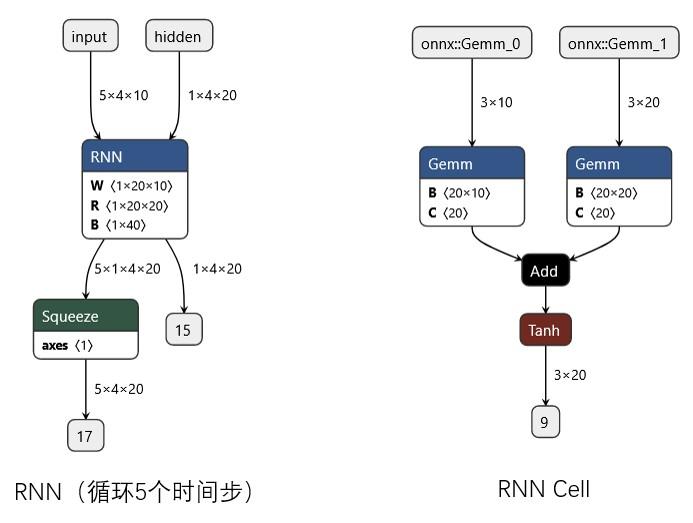
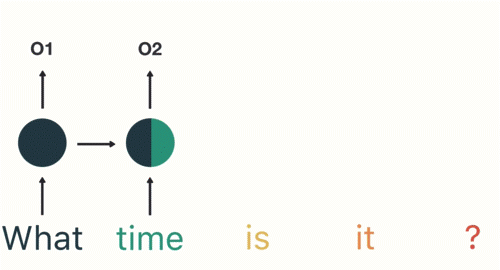
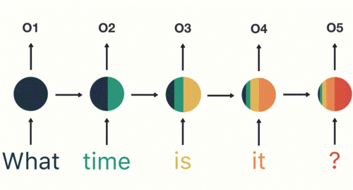
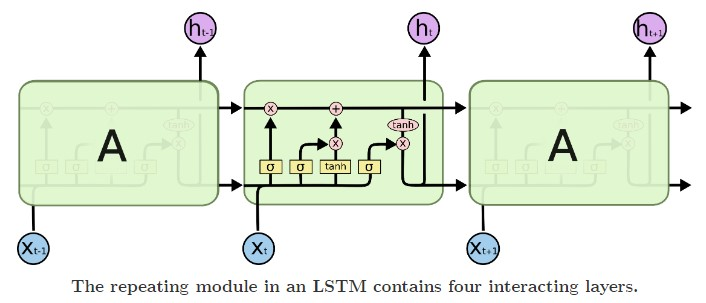
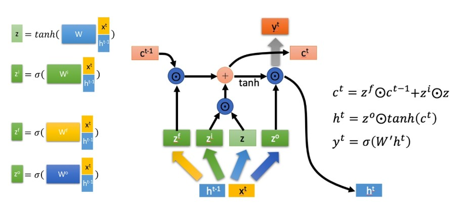
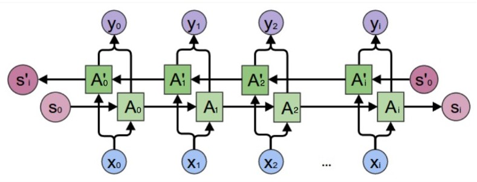
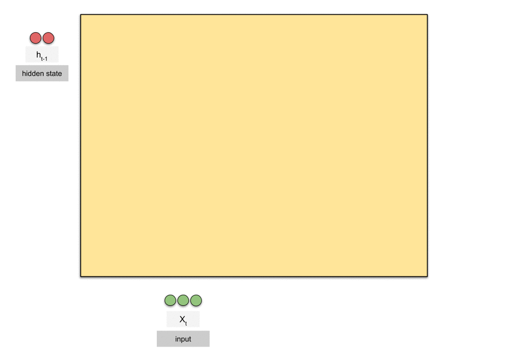

# 0 循环神经网络(Recurrent neural network：RNN)
&nbsp;&nbsp;&nbsp;&nbsp;&nbsp;&nbsp;&nbsp;&nbsp;循环神经网络(RNN)是前馈神经网络在处理序列数据时的一种**自然推广**。 

&nbsp;&nbsp;&nbsp;&nbsp;&nbsp;&nbsp;&nbsp;&nbsp;就像卷积网络是专门用于处理网格化数据（如一个图像）的神经网络，图像被视为独立的个体，彼此之间没有连续性。而对于一些有明显的上下文特征的序列化输入，如完形填空，句子翻译，那么很明显这样的输出必须依赖以前的输入， 也就是说网络必须拥有一定的**记忆能力**。 

&nbsp;&nbsp;&nbsp;&nbsp;&nbsp;&nbsp;&nbsp;&nbsp;为了赋予网络这样的 记忆力，一种特殊结构的神经网络——递归神经网络(Recurrent Neural  Network)便应运而生了。 

# 2 典型的RNN网络
&nbsp;&nbsp;&nbsp;&nbsp;&nbsp;&nbsp;&nbsp;&nbsp;RNNs之所以称为循环神经网路，核心在于一个序列当前的输出与前面的输出也有关, 或者下一时刻的输出要依赖于上一时刻的输出，其典型结构如下图所示： 

&nbsp;&nbsp;&nbsp;&nbsp;&nbsp;&nbsp;&nbsp;&nbsp;网络会对前面的信息进行记忆并应用于当前输出的计算中，即隐藏层之间的节点不再无连接而是有连接的，并且隐藏层的输入不仅包括输入层的输出还包括上一时刻隐藏层的输出。 

# 3 RNN 结构详解
## 3.1 RNN 循环过程如下图所示： 

其中隐藏层会重复执行，每次执行我们习惯上称值为一个时间步。 

隐藏状态按照下图传递： 

sequence 序列输入过程： 

## 3.2 按时间步展开如下： 
**动态图如下**  

**静态图如下**  

## 3.3 经典RNN的计算图如下： 

其中：
- $x_{t}$ 表示第t(t=1,2,3...t...）个时间步（step）的输入
- $s_{t} 为隐藏层的第t步的状态，它是网络的记忆单元
- $o_{t}$ 是第t步的输出

## 3.4 RNN具体计算公式为： 

$$s_{t} = \sigma(W^{sx}x_{t} + W^{hh}s_{t-a})$$  

$$o_{t} = W^{oh}s_{t}$$

**思考：上式三个权重矩阵W每个时间步 是同一份数据吗？？？**

## 3.5 RNN 工程图展示：

**思考：每个时间步为何没有矩阵相乘呢？**

## 3.6 RNN可扩展到双向的情况，其结构如下： 

**思考：正向和反向用到权重是同一份数据吗???**
**思考：反向时句子顺序需要倒序吗？**
**思考：正反向的结果，如何组合在一起？？？**

## 3.7 RNN扩展到多层构成循环神经网络，结构如下：

# 4 RNN 应用案例(意图识别)

&nbsp;&nbsp;&nbsp;&nbsp;&nbsp;&nbsp;&nbsp;&nbsp;如上图所示：将句子逐时间步输入到RNN中，这个过程我们可以看到，输入**time**的时候，前面 **what** 的输出也产生了影响（隐藏层中有一半是黑色的）。前面所有的输入都对未来的输出产生了影响，大家可以看到圆形隐藏层中包含了前面所有的颜色。 

&nbsp;&nbsp;&nbsp;&nbsp;&nbsp;&nbsp;&nbsp;&nbsp;当我们判断意图的时候，只需要最后一层的输出**o5**，如下图所示： 

# 5 经典RNN 存在的问题
&nbsp;&nbsp;&nbsp;&nbsp;&nbsp;&nbsp;&nbsp;&nbsp;通过上面的例子，我们已经发现，短期的记忆影响较大（如橙色区域），但是长期的记忆影响就很小（如黑色和绿色区域），这就是 RNN 存在的短期记忆问题。 

- RNN 有短期记忆问题，无法处理很长的输入序列
- 训练 RNN 需要投入极大的成本

&nbsp;&nbsp;&nbsp;&nbsp;&nbsp;&nbsp;&nbsp;&nbsp;由于 RNN 的短期记忆问题，后来又出现了基于 RNN 的优化算法，LSTM 和 GRU就是典型代表。 

# 6 LSTM(Long Short-Term Memory) 长短期记忆网络
&nbsp;&nbsp;&nbsp;&nbsp;&nbsp;&nbsp;&nbsp;&nbsp;长短期记忆（英语：Long Short-Term Memory，LSTM）是一种时间循环神经网络（RNN），论文首次发表于1997年。由于独特的设计结构，LSTM适合于处理和预测时间序列中间隔和延迟非常长的重要事件。 

## 6.1 LSTM 整体结构

&nbsp;&nbsp;&nbsp;&nbsp;&nbsp;&nbsp;&nbsp;&nbsp;LSTM的核心概念是cell state和其各种gates。cell state充当传输高速公路，将相关信息传递到整个序列链的末端。你可以将其视为网络的“记忆”。理论上，cell state可以在处理序列的过程中携带相关信息。因此，即使是早期时间步的信息也可以传递到后续时间步，减少短期记忆的影响。随着细胞状态的旅程进行，通过门向细胞状态添加或移除信息。这些门是不同的神经网络，决定哪些信息可以进入cell state。这些门可以在训练过程中学习哪些信息是需要保留或遗忘的。 

**简单一点就是：记住该记住的，忘记该遗忘的**  

## 6.2 LSTM cell 详解
一个LSTM Cell 结构图如下： 

其中核心部分为三门（遗忘门、输入门 和 输出门） 一状态（cell state）。 

### 6.2.1 遗忘门
&nbsp;&nbsp;&nbsp;&nbsp;&nbsp;&nbsp;&nbsp;&nbsp; 遗忘门（forget gate）决定之前cell states的哪些信息应该被丢弃和保留。来自前一个隐藏状态和当前输入的信息通过 sigmoid 函数传递。输出的值介于 0 和 1 之间。接近 0 的值表示要遗忘，接近 1 的值表示要保留。 

### 6.2.2 输入门
&nbsp;&nbsp;&nbsp;&nbsp;&nbsp;&nbsp;&nbsp;&nbsp;为了更新细胞状态，我们有输入门（input gate）。 
- 首先，我们将前一个隐藏状态和当前输入传递到 sigmoid 函数中。这个函数决定了哪些值将被更新，通过将这些值转换为介于 0 和 1 之间的范围。0 表示不重要，1 表示重要。 
- 你还需要将隐藏状态和当前输入传递到 tanh 函数中，将值压缩在 -1 和 1 之间，以帮助调节网络。 
- 然后，你将 tanh 的输出与 sigmoid 的输出相乘。sigmoid 的输出将决定从 tanh 的输出中保留哪些重要信息。 

### 6.2.3 cell state
&nbsp;&nbsp;&nbsp;&nbsp;&nbsp;&nbsp;&nbsp;&nbsp;现在我们应该有足够的信息来计算细胞状态。 
- 首先，细胞状态与忘记向量进行逐元素相乘。如果与接近 0 的值相乘，细胞状态中的值有可能被丢弃。 
- 然后，我们将输入门的输出与细胞状态进行逐元素相加，从而将细胞状态更新为神经网络认为相关的新值。 
这样我们就得到了新的细胞状态。 

### 6.2.4 输出门
&nbsp;&nbsp;&nbsp;&nbsp;&nbsp;&nbsp;&nbsp;&nbsp;最后，我们有输出门（output gate）。输出门决定下一个隐藏状态应该是什么样子。请记住，隐藏状态包含了先前输入的信息。隐藏状态还用于进行预测。 
- 首先，我们将前一个隐藏状态和当前输入传递到 sigmoid 函数中。 
- 然后，我们将经过修改后的细胞状态传递到 tanh 函数中。我们将 tanh 的输出与 sigmoid 的输出相乘，以决定隐藏状态应携带哪些信息。 
输出结果就是隐藏状态。新的细胞状态和新的隐藏状态随后传递到下一个时间步。 

### 6.2.5 总结
- 遗忘门决定了从之前的步骤中保留哪些信息是相关的；
- 输入门决定了从当前步骤中添加哪些相关信息；
- 输出门确定了下一个隐藏状态应该是什么样子；

## 6.3 LSTM Cell 具体计算
- 学术上的计算过程如下:  

- 动态展示为： 

- 工程上的计算过程为： 

## 6.4 与RNN 类似 LSTM 也有双向的

# 7 GRU ：门控循环单元（Gated Recurrent Unit）
## 7.1 LSTM 和 GRU 对比

## 7.2 原理
&nbsp;&nbsp;&nbsp;&nbsp;&nbsp;&nbsp;&nbsp;&nbsp;GRU是循环神经网络的新一代，与LSTM非常相似。GRU摒弃了细胞状态，使用隐藏状态来传递信息。它只有两个门，一个重置门(reset gate)和一个更新门(update gate)。 

- 更新门（Update Gate）
&nbsp;&nbsp;&nbsp;&nbsp;&nbsp;&nbsp;&nbsp;&nbsp更新门的功能类似于LSTM中的遗忘门和输入门。它决定了要丢弃哪些信息以及要添加哪些新信息。 

- 重置门（Reset Gate）
&nbsp;&nbsp;&nbsp;&nbsp;&nbsp;&nbsp;&nbsp;&nbsp重置门是另一个门，用于决定要忘记多少过去的信息。 

&nbsp;&nbsp;&nbsp;&nbsp;&nbsp;&nbsp;&nbsp;&nbsp;GRU的张量操作较少，因此相对于LSTM来说，训练速度稍快一些。目前并没有明确的胜出者，哪种方法更好。研究人员和工程师通常会尝试两种方法，以确定哪种方法在特定的使用案例中效果更好。 

## 7.3 计算过程
- 动态计算图： 

- 静态计算图： 

- 可能的变化： 

- 工程上的计算图： 

# 8 参考链接
[参考文献1](http://colah.github.io/posts/2015-08-Understanding-LSTMs/)
[参考文献2](https://towardsdatascience.com/illustrated-guide-to-lstms-and-gru-s-a-step-by-step-explanation-44e9eb85bf21)
[参考文献3](https://towardsdatascience.com/animated-rnn-lstm-and-gru-ef124d06cf45)

