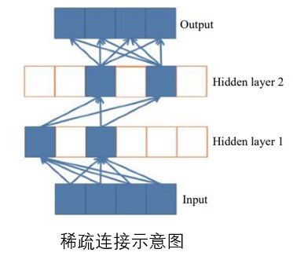
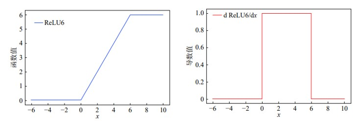
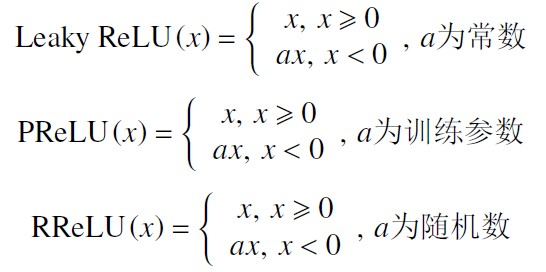
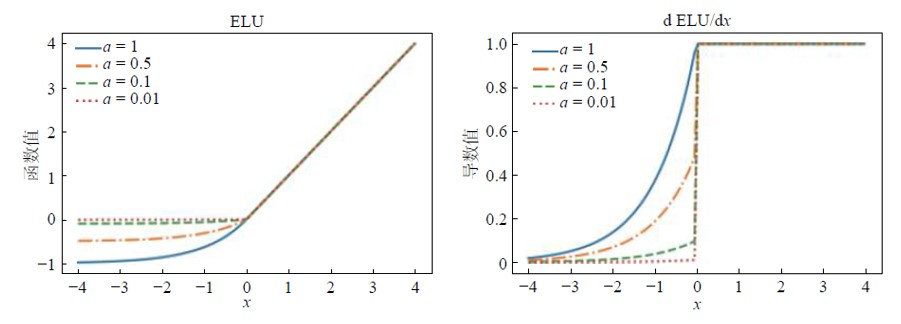
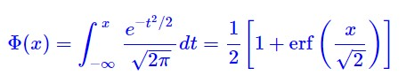
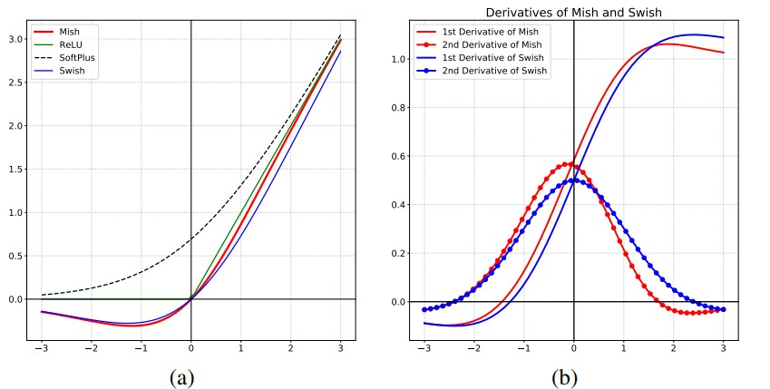

# 0 Activation 整体介绍
**线性神经网络的问题** <br>
&nbsp;&nbsp;&nbsp;&nbsp;&nbsp;&nbsp;&nbsp;&nbsp;全连接层或CNN只是对数据做仿射变换（affine transformation), 多个仿射变换叠加仍是一个仿射变换, 即便再添加更多的隐藏层，依然只能与仅含输出层的单层神经网络等价!<br>
*注释：(仿射变换 :  在几何中, 一个向量空间进行一次线性变换并接上一个平移, 变换为另一个向量空间).* <br>

**解决思路：** <br>
&nbsp;&nbsp;&nbsp;&nbsp;&nbsp;&nbsp;&nbsp;&nbsp;可以通过引入非线性变换，对线性层的输出用 Pointwise 类型的非线性函数进行变换，然后再作为下一个层的输入 来解决线性网络表达能力不足的问题。这个非线性函数被称为激活函数（activation function）。<br>

**总结：** <br>
&nbsp;&nbsp;&nbsp;&nbsp;&nbsp;&nbsp;&nbsp;&nbsp;激活函数可以看作卷积神经网络模型中一个特殊的层，即非线性映射层。卷积神经网络在进行完线性变换后，都会在后边叠加一个非线性的激活函数，在非线性激活函数的作用下数据分布进行再映射，以增加卷积神经网络的非线性表达能力。<br>

**激活函数应该具有什么样的性质：** <br>
- 非线性：即导数不是常数。保证多层网络不退化成单层线性网络。
- 可微性：保证了在优化中梯度的可计算性。虽然 ReLU 存在有限个点处不可微，但处处 subgradient，可以替代梯度。
- 计算简单：激活函数复杂就会降低计算速度，因此 RELU 要比 Exp 等操作的激活函数更受欢迎。
- 非饱和性（saturation）：饱和指的是在某些区间梯度接近于零（即梯度消失），使得参数无法继续更新的问题。最经典的例子是 Sigmoid，它的导数在 x 为比较大的正值和比较小的负值时都会接近于 0。RELU 对于 x<0，其梯度恒为 0，这时候它也会出现饱和的现象。Leaky ReLU 和 PReLU 的提出正是为了解决这一问题。
- 单调性（monotonic）：即导数符号不变。当激活函数是单调的时候，单层网络能够保证是凸函数。但是激活函数如 mish 等并不满足单调的条件，因此单调性并不是硬性条件，因为神经网络本来就是非凸的。
- 参数少：大部分激活函数都是没有参数的。像 PReLU 带单个参数会略微增加网络的大小。

**Zero-centered ???** <br>
&nbsp;&nbsp;&nbsp;&nbsp;&nbsp;&nbsp;&nbsp;&nbsp;Zero-centered激活函数指的是在激活函数的输出中心值为零（例如，均值为零）。相比于非零中心的激活函数（例如ReLU），零中心激活函数在某些情况下**可能**具有一些优势，但**并不一定**在所有情况下都表现更好。<br>

&nbsp;&nbsp;&nbsp;&nbsp;&nbsp;&nbsp;&nbsp;&nbsp;以下是一些与零中心激活函数相关的考虑因素：<br>
- 梯度传播：在**某些**情况下，零中心激活函数可以更好地支持梯度传播。由于零中心激活函数的输出均值为零，可以更容易地保持梯度的一致性，**有助于**网络的收敛和训练。
- 表示能力：一些研究表明，零中心激活函数可以提供更好的网络表示能力。通过将正负值均匀分布在激活函数的输出范围内，零中心激活函数可以更好地捕捉数据中的不同特征。
- 对称性：零中心激活函数具有对称性，这**可能**对某些任务和网络架构更有利。在某些情况下，对称性可以提高网络的稳定性和泛化能力。

*注释：保持梯度一致性指的是在深度神经网络中，通过网络的层级传播梯度时，尽量保持梯度的大小和方向保持一致，避免梯度在传播过程中出现过大或过小的变化。*

&nbsp;&nbsp;&nbsp;&nbsp;&nbsp;&nbsp;&nbsp;&nbsp;然而，需要注意的是，**并非**所有的任务和网络都能从零中心激活函数中受益。在某些情况下，非零中心的激活函数（如ReLU）可能表现**更好**。例如，ReLU可以**更好地**处理稀疏激活和非线性特征。此外，通过使用批归一化等技术，非零中心激活函数的不足也可以在一定程度上**被缓解**。<br>
&nbsp;&nbsp;&nbsp;&nbsp;&nbsp;&nbsp;&nbsp;&nbsp;综上所述，零中心激活函数**并非**在所有情况下都具有更好的性能。选择激活函数时，需要根据具体任务、网络架构和数据特征进行评估和实验，以找到最适合的激活函数。<br>

## 1 S 型激活函数
&nbsp;&nbsp;&nbsp;&nbsp;&nbsp;&nbsp;&nbsp;&nbsp;在深度学习发展初期，传统 S 型非线性饱和激活函数 sigmoid 和 tanh 函数得到了广泛的应用。<br>

**数学公式：** <br> 

$$sigmoid(x) = \frac{1}{1 + e^{-x}}$$

$$ tanh(x) = \frac{e^{x} - e^{-x}}{e^{x} + e^{-x}} $$

**对应的导函数：** <br>

$$\frac{dsigmoid}{dx} = sigmoid(x)(1-sigmoid(x))$$

$$\frac{dtanh}{dx} = 1 - tanh^{2}$$

**函数图如下：** <br>


**S型激活函数分析** <br>
- 由上图(左)可知 ：sigmoid 激活函数值的范围为（0，1），经过它激活得到的数据为非 0 均值；sigmoid 激活函数具有双向饱和性，即在一定数据范围内，其导数收敛于 0 。
- 由上图(右)可知：sigmoid 激活函数导数范围为（0，0.25），且不在（−3，3）的数据导数值很小，在反向传播过程时，导数相乘很容易造成梯度弥散；
- 另外，sigmoid 激活函数求导过程计算量较大，模型训练的时间复杂度较高。
- 由上图左右对比可知：tanh 激活函数解决了 sigmoid 激活函数非 0 均值的问题，且其导数范围为（0，1），从而略微缓减了sigmoid 激活函数梯度弥散的问题；
- 但 tanh 激活函数存在的双向饱和性仍然使得梯度弥散问题存在，且模型训练的时间复杂度较高。

- [pytorch sigmoid 实现](https://pytorch.org/docs/stable/generated/torch.nn.Sigmoid.html#torch.nn.Sigmoid)
```python
import torch.nn as nn
m = nn.Sigmoid()
input = torch.randn(2)
output = m(input)
```

- [pytorch tanh 实现](https://pytorch.org/docs/stable/generated/torch.nn.Tanh.html#torch.nn.Tanh)
```python
m = nn.Tanh()
input = torch.randn(2)
output = m(input)
```

## 2 Relu 激活函数
**概念：** <br>
&nbsp;&nbsp;&nbsp;&nbsp;&nbsp;&nbsp;&nbsp;&nbsp;整流线性单位函数（Rectified Linear Unit, ReLU），又称修正线性单元，是一种人工神经网络中常用的激励函数（activation function），通常指代以斜坡函数及其变种为代表的非线性函数。<br>

**背景** <br>
&nbsp;&nbsp;&nbsp;&nbsp;&nbsp;&nbsp;&nbsp;&nbsp;2010 年，Hinton 首次提出了修正线性单元(rectified linear units，ReLU）作为激活函数。Krizhevsky 等在 2012 年 ImageNet ILSVRC 比赛中使用了激活函数 ReLU。在该比赛中，Krizhevsky等人提出了一种名为AlexNet的深度卷积神经网络架构，该网络结构包含了多个卷积层和全连接层。其中，ReLU被用作卷积层和全连接层之间的激活函数。在图像分类任务上获得了**远远超过**其他参赛者的结果，将错误率降低到了当时的最低水平。这一突破被认为是深度学习在计算机视觉领域的重要里程碑，引发了深度学习在各个领域的广泛应用和发展。<br>

**优势：** <br>
1. 不会发生梯度消失问题。Sigmoid函数在  x>0  会发生梯度消失问题，造成信息损失，从而无法完成深度网络的训练。而 ReLU 函数当  x>0  为线性结构，有固定的梯度，不会消失。
2. ReLU激活函数在  x<0  时会输出为 0 (失活)，这可以造成网络的稀疏性。这样可以很好的模拟人脑神经元工作的原理，且可以减少参数间的相互依赖，缓解了过拟合问题的发生。
3. Sigmoid函数复杂，计算量大 (前向传播+反向传播求导)，速度慢；而ReLU函数简单，计算量小，速度快。

*(注释：人类大脑神经元大约只有  1 \%-4 \%  是在同一时间工作的。从信号方面来看，即神经元同时只对输入信号的少部分选择性响应，大量信号被刻意的屏蔽了，这样可以提高学习的精度，更好更快地提取稀疏特征。)*

**缺点：** <br>
1. 由于激活函数是没有上界的，有可能出现神经网络输出为  \mathrm{NaN}  的情况
2. (重要) ReLU在训练的时候很"脆弱"，很可能产生 Dead ReLU Problem（神经元坏死现象）：某些神经元可能永远不会被激活，导致相应参数永远不会被更新（在负数部分，梯度为 0 )。
*（eg:由于ReLU在  x<0  时梯度为 0 ，这样就导致负的梯度在这个ReLU被置零，而且这个神经元有可能再也不会被任何数据激活。如果这个情况发生了，那么这个神经元之后的梯度就永远是0了，也就是 ReLU神经元坏死了, 不再对任何数据有所响应。)* <br>
3. ReLU不会对数据做幅度压缩，所以数据的幅度会随着模型层数的增加不断扩张。
4. ReLU的输出不是zero-centered；

**计算公式为：** <br>

$$ReLU(x)=max(0,x)$$

**对应图像和导函数图像为：** <br>


- [pytorch 实现](https://pytorch.org/docs/stable/generated/torch.nn.ReLU.html#torch.nn.ReLU)
```python
m = nn.ReLU()
input = torch.randn(2)
output = m(input)

# An implementation of CReLU - https://arxiv.org/abs/1603.05201

m = nn.ReLU()
input = torch.randn(2).unsqueeze(0)
output = torch.cat((m(input), m(-input)))
```

- [ReLU 论文链接](https://proceedings.mlr.press/v15/glorot11a/glorot11a.pdf)

# 3 ReLU6 
**稀疏性再述** <br>
&nbsp;&nbsp;&nbsp;&nbsp;&nbsp;&nbsp;&nbsp;&nbsp;ReLU 的稀疏性给卷积神经网络的训练带来了巨大的成功。从生物学上看，大脑同时被激活的神经元只有1%～4%，进一步表明神经元工作的稀疏性。神经元只对输入信号的少部分选择性响应，大量信号被刻意的屏蔽。类似神经元信号传播，在一定模型下，ReLU 的稀疏性可以提高学习的精度。然而传统的sigmoid 激活函数几乎同时有一半的神经元被激活，这和神经科学的研究不太相符，可能会给深度网络训练带来潜在的问题。<br>

**稀疏连接图示：** <br>


**ReLU6 概念** <br>
&nbsp;&nbsp;&nbsp;&nbsp;&nbsp;&nbsp;&nbsp;&nbsp;在深度学习中，有研究者尝试使用ReLU6 激活函数。ReLU6 是在ReLU 激活函数的基础上将大于6 的数据部分置为0，以进一步提高连接的稀疏性。<br>

**ReLU6 公式** <br>
$$ReLU(x)=min(max(0,x), 6)$$

**ReLU6 图示** <br>


[pytorch 实现](https://pytorch.org/docs/stable/generated/torch.nn.ReLU6.html#torch.nn.ReLU6)
```python
m = nn.ReLU6()
input = torch.randn(2)
output = m(input)
```

# 4 其它ReLU 相关 激活函数
&nbsp;&nbsp;&nbsp;&nbsp;&nbsp;&nbsp;&nbsp;&nbsp;为了解决Relu 负半轴“神经元坏死”的情况，研究者们对ReLU 的负半轴下功夫改造，提出了LeakyReLU（ leaky rectified linear unit） 、PReLU（ parametric rectified linear unit） 、RReLU（ randomized leaky rectified linear unit）等激活函数。<br>

**对应公式如下** <br>


**图示** <br>


- [pytorch LeakeyRelu 实现](https://pytorch.org/docs/stable/generated/torch.nn.LeakyReLU.html#torch.nn.LeakyReLU)
```python
m = nn.LeakyReLU(0.1)
input = torch.randn(2)
output = m(input)
```

- [pytorch PReLU 实现](https://pytorch.org/docs/stable/generated/torch.nn.PReLU.html#torch.nn.PReLU)
```python
m = nn.PReLU()
input = torch.randn(2)
output = m(input)
```

- [pytorch RReLU 实现](https://pytorch.org/docs/stable/generated/torch.nn.RReLU.html#torch.nn.RReLU)
```python
m = nn.RReLU(0.1, 0.3)
input = torch.randn(2)
output = m(input)
```
- [RReLU 论文](https://arxiv.org/pdf/1505.00853.pdf)

# 5 ELU(Exponential Linear Units) 和 SELU(Scaled ELU)
&nbsp;&nbsp;&nbsp;&nbsp;&nbsp;&nbsp;&nbsp;&nbsp;ELU 激活函数的正半轴与ReLU 激活函数保持一致，对负半轴引入软饱和以代替置“0”。ELU 激活函数在正半轴具有与ReLU 激活函数一样的优势，同时引入了负半轴的定义使得**整体输出均值接近0**。与LeakyReLU 和PReLU 相比，虽同样都是激活了负半轴，但ELU 的负半轴为软饱和区，斜率具有衰减性，这使得其对噪声有一些鲁棒性。同时，参数控制着函数的斜率变化。<br>

**公式如下：** <br>


**图像如下：** <br>


**效果** <br>
当 $\lambda \approx 1.0507;  \alpha \approx 1.6732$ 时，且weight正态分布时，各层输出近似正态分布，消除梯度消失和爆炸，让结构简单的网络甚至超过sota性能.<br>

- [pytorch ELU 实现](https://pytorch.org/docs/stable/generated/torch.nn.ELU.html#torch.nn.ELU)
```python
m = nn.ELU()
input = torch.randn(2)
output = m(input)
```
- [ELU 论文](https://arxiv.org/abs/1511.07289)

- [pytorch SELU 实现](https://pytorch.org/docs/stable/generated/torch.nn.SELU.html#torch.nn.SELU)
```python
m = nn.SELU()
input = torch.randn(2)
output = m(input)
```
- [SELU 论文](https://arxiv.org/abs/1706.02515)

# 6 GeLU（Gaussian Error Linear Unit）
**背景**<br>
&nbsp;&nbsp;&nbsp;&nbsp;&nbsp;&nbsp;&nbsp;&nbsp;Dropout、ReLU 都希望将 **不重要** 的激活信息规整为零，收到这两个函数的影响，学者提出了GELU激活函数。此激活函数的特点是随着 x 的降低，它被归零的概率会升高，而不向relu那样直接置0。<br>

**影响力** <br>
- 此激活函数早在 2016 年即被人提出，然而其论文迄今为止在 Google Scholar 上的被引用次数却只有 34 次。
- 其实，GELU 已经被很多目前最为领先的模型所采用。据不完全统计，BERT、RoBERTa、ALBERT 等目前业内顶尖的 NLP 模型都使用了这种激活函数。
- 另外，在 OpenAI 声名远播的无监督预训练模型 GPT-2 中，研究人员在所有编码器模块中都使用了 GELU 激活函数。

**公式**<br>

$$GELU(x)= x P(X \leq x) = x \Phi(x)$$

其中：<br>


*注释：这就是高斯误差函数名称的由来** <br>

上式计算量太大，可化简为：<br>

$$ x \Phi(x) \approx x \sigma(1.702 x) $$

$$ x \Phi(x) \approx \frac{1}{2} \times [1 + tanh (\sqrt{\frac{2}{\pi}}(x+0.044715 x^{3}))]$$

**图像：** <br>


- [gelu pytorch 实现](https://pytorch.org/docs/stable/generated/torch.nn.GELU.html#torch.nn.GELU)
```python
m = nn.GELU()
input = torch.randn(2)
output = m(input)
```

- [GeLU 论文链接](https://arxiv.org/pdf/1606.08415.pdf)

# 7 Swish 与 Hardswish
**背景** <br>
&nbsp;&nbsp;&nbsp;&nbsp;&nbsp;&nbsp;&nbsp;&nbsp;2017年 google brain 的研究人员使用自动搜索(automated search)技术寻找更好的激活函数，并提出了一种新的激活函数：Swish。旨在希望可以找到一个最优的激活函数，使得以后不用人为设计激活函数了。<br>

*注释：S 代表 S型神经元，wish就是希望的意思。* <br>

**公式：** <br>

$$Swish(x)=x \cdot sigmoid(\beta x)$$

$$Hardswish(x) =x \frac{ReLU6(x+3)}{6}$$

- 其中β是一个常数或可学习的参数；
- 当 β = 0 时，Swish函数退化成线性函数 $\frac{x}{2}$;
- 当 β → ∞ 时，Swish函数退化成ReLU函数；
- 因此**Swish函数可以看作是线性函数和ReLU函数之间的光滑非线性插值结果**。

**图像** <br>


**swish vs hard swish** <br>


- [pytorch Hardswish 实现](https://pytorch.org/docs/stable/generated/torch.nn.Hardswish.html#torch.nn.Hardswish)
```python
m = nn.Hardswish()
input = torch.randn(2)
output = m(input)
```

- [Swish 论文](https://arxiv.org/pdf/1710.05941v1.pdf?source=post_page) <br>
- [search activation functions 论文](https://arxiv.org/abs/1710.05941) <br>

# 8 mish 
**原理** <br>
&nbsp;&nbsp;&nbsp;&nbsp;&nbsp;&nbsp;&nbsp;&nbsp;对激活函数的研究一直没有停止过，ReLU还是统治着深度学习的激活函数，不过，这种情况有可能会被Mish改变，目前的想法是，平滑的激活函数允许更好的信息深入神经网络，从而得到更好的准确性和泛化, Mish函数在曲线上几乎所有点上的平滑度都很高。<br>

**结论** <br>
&nbsp;&nbsp;&nbsp;&nbsp;&nbsp;&nbsp;&nbsp;&nbsp;mish 激活函数在最终准确度上比Swish(+.494%)和ReLU(+ 1.671%)都有提高. <br>

**公式** <br>

$$ Mish(x) = x \times tanh(ln(1+e^{x}))$$

**图像** <br>


- [Mish pytorch 实现](https://pytorch.org/docs/stable/generated/torch.nn.Mish.html#torch.nn.Mish)
```python
m = nn.Mish()
input = torch.randn(2)
output = m(input)
```

- [论文链接](https://arxiv.org/abs/1908.08681)

# 9 Softmax
&nbsp;&nbsp;&nbsp;&nbsp;&nbsp;&nbsp;&nbsp;&nbsp;softmax函数用于将一组实数转换为范围在[0, 1]之间且总和为1的概率分布。它常用于多类分类问题中，将原始预测值转换为类别概率。<br>

**思考：与其它激活函数有何不同？？？**

**公式** <br>

$$Softmax(x_{i}) = \frac{\exp (x_{i})}{\sum_{j} \exp (x_{j})}$$

- [Softmax pytorch 实现](https://pytorch.org/docs/stable/generated/torch.nn.Softmax.html#torch.nn.Softmax)
```python
m = nn.Softmax(dim=1)
input = torch.randn(2, 3)
output = m(input)
```

# 10 总结：好的激活函数应有的性质
&nbsp;&nbsp;&nbsp;&nbsp;&nbsp;&nbsp;&nbsp;&nbsp;依据上文的讨论及激活函数的发展规律，可以初步得出一个良好的激活函数常具备以下一些特点：<br>
1. 非线性以及可微性;
2. 解决梯度消失问题，也避免出现梯度爆炸问题;
3. 解决“神经元坏死问题;
4. 符合或近似符合0 均值分布;
5. 计算的时间、空间复杂度小;
6. 存在一定的稀疏性;
7. 计算复杂度低。

# 11 参考链接
- [激活函数汇总](http://spytensor.com/index.php/archives/23/?xqrspi=xnemo1) <br>
- [激活函数综述](https://www.xhuqk.com/xhdxxbzkb/article/doi/10.12198/j.issn.1673-159X.3761) <br>
- [Activation 可视化](https://dashee87.github.io/deep%20learning/visualising-activation-functions-in-neural-networks/) <br>
