# 1 从RNN 到 Seq2Seq
## 1.1 RNN 简述
&nbsp;&nbsp;&nbsp;&nbsp;&nbsp;&nbsp;&nbsp;&nbsp;实际场景中，会遇到很多序列型输入数据的情况或问题： 
- 自然语言处理(nlp)问题。x1可以看做是第一个单词，x2可以看做是第二个单词，依次类推；
- 语音处理。此时，x1、x2、x3……是每帧的声音信号；
- 时间序列问题。例如每天的股票价格等等。

&nbsp;&nbsp;&nbsp;&nbsp;&nbsp;&nbsp;&nbsp;&nbsp;这些序列形的数据就不太好用原始的神经网络处理了。为了建模序列问题，RNN引入了隐状态h（hidden state）的概念，h可以对序列形的数据提取特征，接着再转换为输出，如下图典型RNN 原理图所示： 

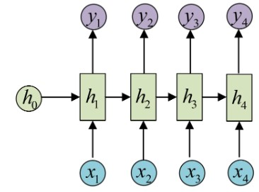

**其中：**  
- 圆圈或方块表示的是向量;
- 一个箭头就表示对该向量做一次变换(如上图中h0和x1分别有一个箭头连接，就表示对h0和x1各做了一次变换).

## 1.2 RNN 应用场景
&nbsp;&nbsp;&nbsp;&nbsp;&nbsp;&nbsp;&nbsp;&nbsp;值得注意的是，RNN的输入是 $x_{1}, x_{2}, \dots, x_{n}$ ，输出为 $y_{1}, y_{2}, \dots, y_{n}$ ，也就是说，输入和输出序列必须要是等长的。由于这个限制的存在，经典RNN的适用范围比较小，但也有一些问题适合用经典的RNN结构建模.  

### 1.2.1 RNN 解决 N VS N 问题
- ner 问题；
- 完形填空问题等；

### 1.2.2 RNN 解决 N Versus 1 问题

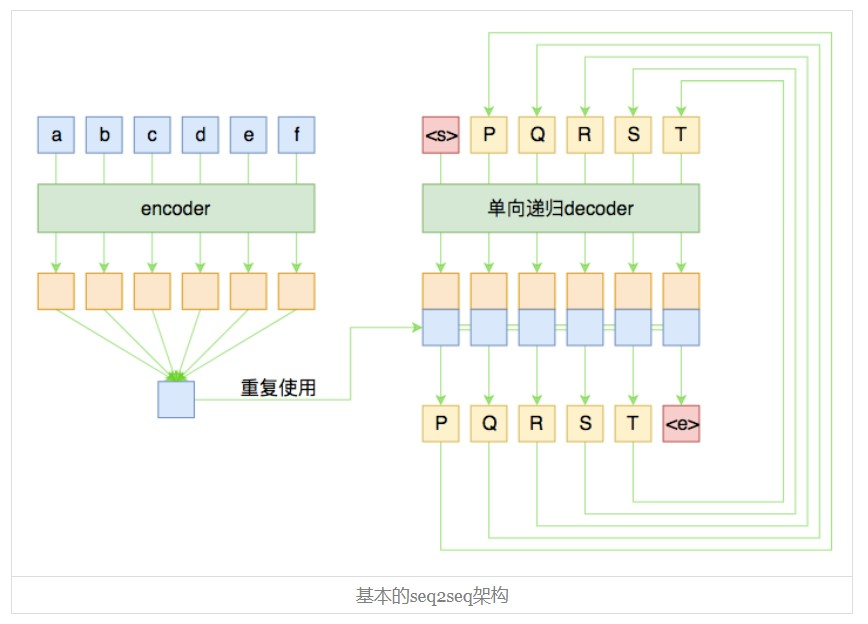

&nbsp;&nbsp;&nbsp;&nbsp;&nbsp;&nbsp;&nbsp;&nbsp;这种结构通常用来处理序列分类问题。如输入一段文字判别它所属的类别，输入一个句子判断其情感倾向，输入一段视频并判断它的类别等等。 

### 1.2.3 RNN 解决 1 VS N 问题
&nbsp;&nbsp;&nbsp;&nbsp;&nbsp;&nbsp;&nbsp;&nbsp;当输入不是序列而输出为序列的情况怎么处理？我们可以只在序列开始进行输入计算： 

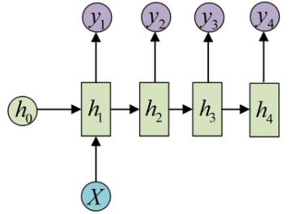

&nbsp;&nbsp;&nbsp;&nbsp;&nbsp;&nbsp;&nbsp;&nbsp;还有一种结构是把输入信息X作为每个阶段的输入:  

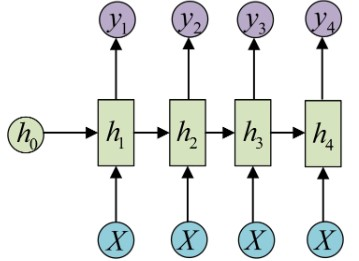

其等价表示为：

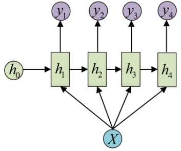

&nbsp;&nbsp;&nbsp;&nbsp;&nbsp;&nbsp;&nbsp;&nbsp;这种1 VS N的结构可以处理的问题有： 
- 从图像生成文字（image caption），此时输入的X就是图像的特征，而输出的y序列就是一段句子
- 从类别生成语音或音乐等

## 1.3 N VS M 型任务
&nbsp;&nbsp;&nbsp;&nbsp;&nbsp;&nbsp;&nbsp;&nbsp;假如输入序列长度为N，输出序列长度M(**不确定具体长度**)， M≠N时，RNN就无法直接解决，然而我们遇到的大部分问题序列都是不等长的，如机器翻译中，源语言和目标语言的句子往往并没有相同的长度。 

&nbsp;&nbsp;&nbsp;&nbsp;&nbsp;&nbsp;&nbsp;&nbsp;因此出现了RNN最重要的一种任务：N vs M 问题。解决此问题的结构称之为**Encoder-Decoder模型**，也可以称之为**Seq2Seq模型**。 

# 2 Seq2Seq 模型

# 2.1 Seq2Seq 定义
- [wikipedia 定义]([images/seq2seq-figure6.jpg](https://zh.wikipedia.org/wiki/Seq2Seq%E6%A8%A1%E5%9E%8B))

&nbsp;&nbsp;&nbsp;&nbsp;&nbsp;&nbsp;&nbsp;&nbsp;Seq2seq（Sequence to sequence）模型，是将序列（Sequence）映射到序列的神经网络（neural network）机器学习模型。这个模型最初设计用于改进机器翻译技术，可容许机器通过此模型发现及学习将一种语言的语句（词语序列）映射到另一种语言的对应语句上。除此之外，Seq2Seq也能广泛地应用到各种不同的技术上，如聊天机器人、Inbox by Gmail等，但需要有配对好的文本集才能训练出对应的模型。 

&nbsp;&nbsp;&nbsp;&nbsp;&nbsp;&nbsp;&nbsp;&nbsp;Seq2seq将输入序列转换为输出序列。它通过利用循环神经网络（递归神经网络）或更常用的**LSTM、 GRU**网络来避免梯度消失问题。当前项的内容总来源于前一步的输出。Seq2seq主要由一个编码器和一个解码器组成。 编码器将输入转换为一个隐藏状态向量，其中包含输入项的内容。 解码器进行相反的过程，将向量转换成输出序列，并使用前一步的输出作为下一步的输入。[4]

# 2.2 seq2seq 模型结构
&nbsp;&nbsp;&nbsp;&nbsp;&nbsp;&nbsp;&nbsp;&nbsp;在Seq2Seq结构中，编码器(Encoder)把所有的输入序列都编码成一个统一的语义向量**Context**，然后再由解码器(Decoder)解码。在解码器(Decoder)解码的过程中，不断地将前一个时刻 t-1 的输出作为后一个时刻 t -1 的输入，循环解码，直到输出停止符为止。 
&nbsp;&nbsp;&nbsp;&nbsp;&nbsp;&nbsp;&nbsp;&nbsp;与经典RNN结构不同的是，**Seq2Seq结构不再要求输入和输出序列有相同的时间长度！**  

### 2.2.1 encoder-decoder 架构
**encoder - decoder 经典结构可表示如下：**  

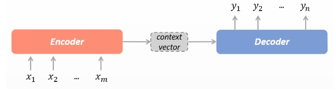

**按序列展开形式如下：**

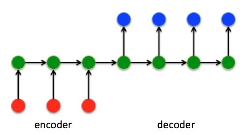

### 2.2.2 encoder 部分
&nbsp;&nbsp;&nbsp;&nbsp;&nbsp;&nbsp;&nbsp;&nbsp; seq2seq 的 encoder 部分 的主要作用是将输入序列编码成一个**上下文向量(Context vector)**, 这个Context vector 包含了整个输入序列的信息: 

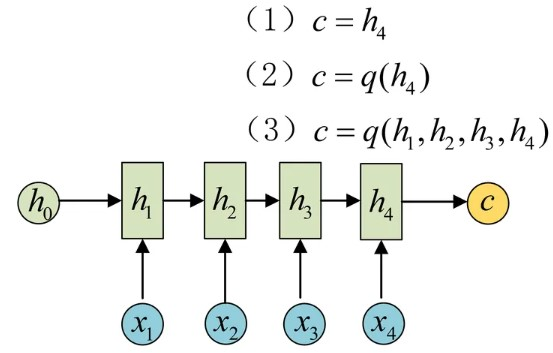

&nbsp;&nbsp;&nbsp;&nbsp;&nbsp;&nbsp;&nbsp;&nbsp;如图所示，得到Context的方式有很多种： 
- 最简单的方法就是把Encoder的最后一个隐状态赋值给Context vector;
- 还可以对最后的隐状态做一个变换得到Context vector，也可以对所有的隐状态做变换;
- 还可以对每层的输出做加权后做变换得到Context vector.

### 2.2.3 decoder 部分
&nbsp;&nbsp;&nbsp;&nbsp;&nbsp;&nbsp;&nbsp;&nbsp;decoder 部分的作用就是接受encoder 输出的context vector，然后一步步将输出序列解码出来, 有不同的解码方式可供选择。 

**形式1: Context vector 作为 decoder 的 h0输入到Decoder中：**  

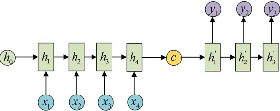

**形式2: 将Context vector 当做每一步的输入 输入到 Decoder 的每个时间步中：**  

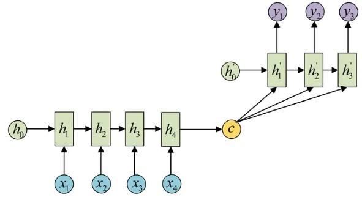

**思考：NLP 中 哪种形式用的比较多呢？？？**

## 2.3 Seq2Seq 实现举例

&nbsp;&nbsp;&nbsp;&nbsp;&nbsp;&nbsp;&nbsp;&nbsp;为了展示Seq2Seq模型的运行过程，我们以机器翻译为例，整个encoder-decoder 过程为:  

**Decoder 细节展开图如下**  

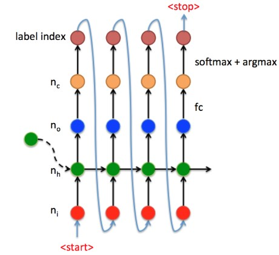

其中：
- 红点是embdding 后的输入向量；
- 绿点是RNN单元；
- 蓝点是某一时刻的输出向量；
- 橘黄点是线性变换后的值；
- 最上点是此时间步的输出，一般为 词汇表的index 索引.

# 3 Seq2Seq 中的 Attention 机制
&nbsp;&nbsp;&nbsp;&nbsp;&nbsp;&nbsp;&nbsp;&nbsp;在Encoder-Decoder结构中，Encoder把所有的输入序列都编码成一个统一的语义特征context vector再解码。因此 context 中必须包含原始序列中的所有信息，输入序列的长度就成了限制模型性能的瓶颈。如机器翻译问题，当要翻译的句子较长时，一个context可能存不下那么多信息，就会造成翻译精度的下降。 

**思考：如何解决这个问题并改进 Seq2Seq结构呢？？？***

## 3.1 Seq2Seq 中的 Attention 机制
&nbsp;&nbsp;&nbsp;&nbsp;&nbsp;&nbsp;&nbsp;&nbsp;所以如果要改进Seq2Seq结构，最好的切入角度就是：利用Encoder所有隐藏层状态 $h_{t}$ 解决Context长度限制问题。 

**思路图如下：**  

&nbsp;&nbsp;&nbsp;&nbsp;&nbsp;&nbsp;&nbsp;&nbsp;而工程上通常使用**Luong Attention** 来改善或解决长度限制问题，Luong Attention 的原理图如下： 
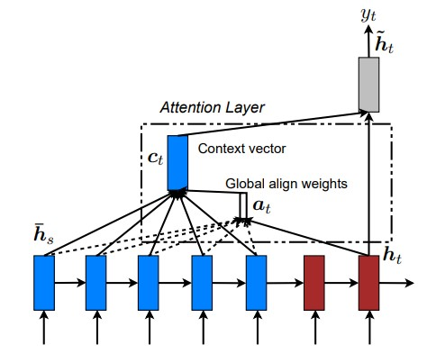

&nbsp;&nbsp;&nbsp;&nbsp;&nbsp;&nbsp;&nbsp;&nbsp;整个seq2seq流程可以表述如下： 

- [luong attention 论文](https://arxiv.org/pdf/1508.04025v5.pdf)

# 4 Seq2Seq 的工作流程
## 4.1 预测时流程
&nbsp;&nbsp;&nbsp;&nbsp;&nbsp;&nbsp;&nbsp;&nbsp;预测时(Inference/predict)，Encoder端没什么变化，在Decoder端，使用**自产自销的策略**：每一步的预测结果，都送给下一步作为输入，直至输出<end>就结束, 这种模式我们称之为**free running** 。这时的Decoder就是一个**语言模型(LM)**。由于这个语言模型是根据context vector来进行文本的生成的，因此这种类型的语言模型，被称为**条件语言模型(Conditional LM)**。
&nbsp;&nbsp;&nbsp;&nbsp;&nbsp;&nbsp;&nbsp;&nbsp;条件语言模型可以使用一些预训练好的语言模型来对Decoder的参数进行初始化，从而可以加快迭代过程(具体见4.3节)。 

*(语言模型（Language Modeling）：对给定的上下文进行下一个单词或字符的预测，用于自动补全、机器翻译等任务)*

**预测或推理时的流程图如下：**  

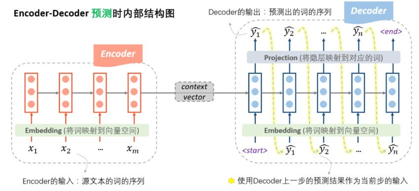

## 4.2 训练时流程

**思考：在训练的时候，可以直接使用预测时语言模型(LM)的模式，使用上一步的预测来作为下一步的输入吗？？？**

&nbsp;&nbsp;&nbsp;&nbsp;&nbsp;&nbsp;&nbsp;&nbsp;**free running** 的模式不能在训练时使用吗？——当然是可以的！从理论上没有任何的问题，又不是不能跑。但是，在实践中人们发现，这样训练非常困难。因为没有任何的引导，一开始会完全是瞎预测，正所谓**一步错，步步错**，而且越错越离谱，这样会导致训练时的累积损失太大（「误差爆炸」问题，exposure bias），训练起来非常艰难。 

**思考：如何解决这个问题呢？？？**  

### 4.2.1 Teacher Forcing 
&nbsp;&nbsp;&nbsp;&nbsp;&nbsp;&nbsp;&nbsp;&nbsp;一种自然的思路是，在每一步的预测时，让老师来指导一下，即提示一下上一个词的正确答案，decoder就可以快速步入正轨，训练过程也可以更快收敛。因此大家把这种方法称为**teacher forcing**。所以，这种操作的目的就是为了使得训练过程更容易，过程如下图所示。 

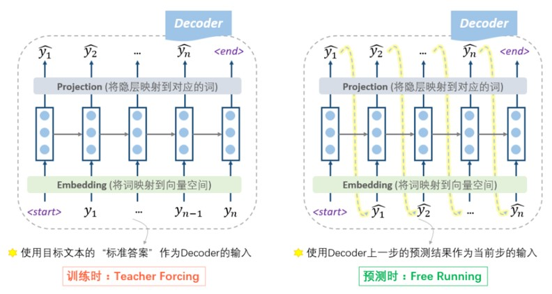

**思考：Teacher Forcing 就没问题吗？？？**

### 4.2.2 Scheduled sampling
&nbsp;&nbsp;&nbsp;&nbsp;&nbsp;&nbsp;&nbsp;&nbsp;更高端的教学模式是老师只给适量的引导，学生也积极学习。即我们设置一个概率p，每一步，以概率p靠自己上一步的输入来预测，以概率1-p根据老师的提示来预测，这种方法称为 **计划采样(scheduled sampling)**。  

[scheduled sampling](images/seq2seq-figure18.jpg)

*(注意: 在seq2seq的训练过程中，decoder即使遇到了<end>标识也不会结束，因为训练的时候并不是一个生成的过程 ，我们需要等到“标准答案”都输入完才结束。)*  

## 4.3 Decoder的预训练
&nbsp;&nbsp;&nbsp;&nbsp;&nbsp;&nbsp;&nbsp;&nbsp;前面提到过，Decoder其实是一种**条件语言模型(Conditional LM)**。条件语言模型意味着Decoder 训练好了之后，具有了某种能力，可以处理不同的Context vector 产生不同的结果。此时，Decoder 无需再变化，只需要更新Context vector就好了。 

**思考：这是否意味着Decoder模型学到了一些通用的知识呢？？？**  

&nbsp;&nbsp;&nbsp;&nbsp;&nbsp;&nbsp;&nbsp;&nbsp;实际工程中，在训练过程中常使用**预训练**的语言模型来初始化Decoder的参数，原因如下： 

- 加速收敛：预训练的语言模型通常经过大规模的数据和计算资源训练得到，具有较好的语言表示能力。通过使用预训练模型初始化Decoder的参数，可以将这些丰富的语言表示能力引入到模型中，从而为模型提供一个较好的起点。这有助于加快模型的收敛速度，减少训练时间和资源消耗。
- 提供语义信息：预训练的语言模型在大规模数据上学习到了丰富的语义信息和语言规律。通过初始化Decoder参数，模型可以从预训练模型中继承这些有用的语言特征和知识，从而更好地理解和生成文本。这有助于生成更准确、流畅的语句，并提高生成文本的语义质量。
- 缓解数据稀疏性问题：在训练过程中，特别是当训练数据较少时，语言模型可能面临数据稀疏性的问题。通过使用预训练模型初始化Decoder的参数，可以利用预训练模型在大规模数据上学习到的语言分布信息，缓解数据稀疏性问题，提高模型的泛化能力和生成能力。
&nbsp;&nbsp;&nbsp;&nbsp;&nbsp;&nbsp;&nbsp;&nbsp;需要注意的是，预训练的语言模型通常是在大规模的无监督数据上进行预训练，而在具体任务上进行微调。这种预训练-微调的方式可以在任务特定的数据上进行更好的参数优化，同时保留了预训练模型所学到的通用语言表示能力。这种迁移学习的思想使得使用预训练语言模型来初始化Decoder参数成为一种有效的策略。 

# 5 Seq2Seq 的损失函数
&nbsp;&nbsp;&nbsp;&nbsp;&nbsp;&nbsp;&nbsp;&nbsp;前面我们详细介绍了seq2seq的内部的结构，明白了内部结构，想知道是怎么训练的就很容易了。 

&nbsp;&nbsp;&nbsp;&nbsp;&nbsp;&nbsp;&nbsp;&nbsp; 在之前图中，我们看到decoder的每一步产生隐状态 $h_{t}$ 后，会通过一个projection层映射到对应的词。那怎么去计算每一步的损失呢？实际上，这个projection层，通常是一个softmax神经网络层，假设词汇量是V，则会输出一个V维度的向量，每一维代表是某个词的概率。映射的过程就是把最大概率的那个词找出来作为预测出的词。 

&nbsp;&nbsp;&nbsp;&nbsp;&nbsp;&nbsp;&nbsp;&nbsp;在计算损失的时候，我们使用交叉熵作为损失函数，所以我们要找出这个V维向量中，正确预测对应的词的那一维的概率大小 $\hat{p}$ ，则这一步的损失就是它的负导数 $-log(\hat{p})$ ，将每一步的损失求和，即得到总体的损失函数： 

$$J  =-\log (p (\hat{y_{1}}))-\log (p(\hat{y_{2}}))-\ldots-\log (p (\hat{y_{n}}))-\log (p([E O S])) =-\frac{1}{T} \sum_{i}^{T} \log (p(\hat{y_{i}}))$$

其中：
- T代表Decoder有多少步；
- [EOS]代表 **end of sentence** 这个特殊标记(token).

# 6 Decoding 中的 Beam search
## 6.1 贪心decoding
&nbsp;&nbsp;&nbsp;&nbsp;&nbsp;&nbsp;&nbsp;&nbsp;前面画的几个图展示的预测过程，其实是最简单的decoding方式: **Greedy Decoding** ，即每一步，都预测出概率最大的那个词，然后输入给下一步, 如下图所示。 

[Greedy Decoding](images/seq2seq-figure19.jpg)

&nbsp;&nbsp;&nbsp;&nbsp;&nbsp;&nbsp;&nbsp;&nbsp;这种Greedy的方式，简单快速，但是既然叫“贪心”，肯定会有问题，那就是**每一步最优，不一定全局最优**，这种方式很可能“捡了芝麻，丢了西瓜” 。 
&nbsp;&nbsp;&nbsp;&nbsp;&nbsp;&nbsp;&nbsp;&nbsp;改进的方法，就是使用 **Beam Search**方法：每一步，多选几个作为候选，最后综合考虑，选出最优的组合。 

## 6.2 Beam search 原理
&nbsp;&nbsp;&nbsp;&nbsp;&nbsp;&nbsp;&nbsp;&nbsp;Beam Search的操作步骤如下： 
- 首先，我们需要设定一个候选集的大小beam size=k；
- 每一步的开始，我们从每个当前输入对应的所有可能输出，计算每一条路的“序列得分”；
- 保留“序列得分”最大的k个作为下一步的输入；
- 不断重复上述过程，直至结束，选择“序列得分”最大的那个序列作为最终结果。

**Beam search 原理图**  

[beam search](images/seq2seq-figure20.jpg)

&nbsp;&nbsp;&nbsp;&nbsp;&nbsp;&nbsp;&nbsp;&nbsp;在每一步，我们都会去对所有的可能输出，计算一次score，假设beam size为k，词汇量为V，那么每一步就需要分出k×V个分支并逐一计算score。所以在图中我们可以看到除了第一步，后面每一步都是分出来2×3=6支。然后综合这k×V个score的结果，只选择其中最大的k个保留。 

## 6.3 公式分析
&nbsp;&nbsp;&nbsp;&nbsp;&nbsp;&nbsp;&nbsp;&nbsp;这里的重点就在于这个“序列得分”的计算, 我们使用如下的score函数来定义序列得分： 

$$score(y_{1}, \ldots, y_{t})=\sum_{i=1}^{t} \log P(y_{i} \mid y_{1}, y_{2}, \ldots, y_{i-1}, x)$$

&nbsp;&nbsp;&nbsp;&nbsp;&nbsp;&nbsp;&nbsp;&nbsp;这个score代表了当前到第t步的输出序列的一个综合得分，越高越好。其中 $log P(y_{i} \mid y_{1}, y_{2}, \ldots, y_{i-1}, x)$ 类似于前面我们写的第t步的交叉熵损失的负数。 所以这个score越大， 就意味着到当前这一步为止，输出序列的累积损失越小。 

## 6.4 Beam search 分析
**思考：每一步会选择k个候选项作为下一步的扩展，但是随着序列长度的增加，就意味着候选结果会一直增多吗？？？。**  

&nbsp;&nbsp;&nbsp;&nbsp;&nbsp;&nbsp;&nbsp;&nbsp;在每一步选择k个候选项时，Beam Search会根据某种评估指标（例如概率、得分）对候选项进行排序，然后选择概率或得分最高的k个候选项。这意味着在下一步扩展时，只有k个候选项会被保留，而其他的候选项会被丢弃。因此，虽然在每一步都会考虑k个候选项，但是随着序列长度的增加，只有其中最好的k个候选项会被保留，而其他的候选项会被淘汰。这样，随着序列长度的增加，候选结果的数量并不会一直增多，而是保持在k个。Beam Search算法通过这种方式在保持一定搜索广度的同时，控制了候选结果的数量，从而在搜索空间中找到可能性较高的序列。 

**思考：要等到所有句子 <end> 整个decoding 过程才结束吗？？？**  

&nbsp;&nbsp;&nbsp;&nbsp;&nbsp;&nbsp;&nbsp;&nbsp;由于分支有时候会较多，如果等每一个分支都遇到<end>才停的话，可能耗时太久，因此一般我们会设定一些规则，比如已经走了T步，或者已经积累了N条已完成的句子，就终止beam search过程。 

**思考：最后N个序列选哪个，根据总分还是平均分？？？**  

&nbsp;&nbsp;&nbsp;&nbsp;&nbsp;&nbsp;&nbsp;&nbsp;在search结束之后，我们需要对已完成的N个序列做一个抉择，挑选出最好的那个，那不就是通过前面定义的score函数来比较吗？确实可以，但是如果直接使用score来挑选的话，会导致那些很短的句子更容易被选出。因为score函数的每一项都是负的，序列越长，score往往就越小。因此我们可以使用长度来对score函数进行细微的调整：对每个序列的得分，除以序列的长度。根据调整后的结果来选择best one。 

# 7 NLP 中常见任务
&nbsp;&nbsp;&nbsp;&nbsp;&nbsp;&nbsp;&nbsp;&nbsp;NLP（自然语言处理）领域有许多常见的任务，涵盖了对自然语言进行理解和生成的各个方面。以下是一些常见的NLP任务： 
1. 文本分类（Text Classification）：将文本分为不同的类别或标签，如情感分类、主题分类等。
2. 命名实体识别（Named Entity Recognition，NER）：从文本中识别和提取命名实体，如人名、地名、组织机构等。
3. 信息抽取（Information Extraction）：从非结构化文本中提取结构化信息，如关系抽取、事件抽取等。
4. 问答系统（Question Answering）：回答用户提出的自然语言问题，可以是基于检索的问答或阅读理解型问答。
5. 机器翻译（Machine Translation，MT）：将一种语言的文本翻译成另一种语言的文本。
6. 情感分析（Sentiment Analysis）：分析文本的情感倾向，判断文本是正面的、负面的还是中性的。
7. 文本生成（Text Generation）：生成符合语法和语义规则的文本，如文本摘要、对话生成等。
8. 语言模型（Language Modeling）：对给定的上下文进行下一个单词或字符的预测，用于自动补全、机器翻译等任务。
9. 序列标注（Sequence Labeling）：给定输入序列，为每个序列元素分配一个标签，如词性标注、命名实体识别等。
10. 文本聚类（Text Clustering）：将文本集合分成不同的群组，每个群组包含相似的文本。
11. 文本摘要（Text Summarization）：从长文本中提取关键信息，生成较短的摘要。
12. 对话系统（Dialogue Systems）：处理人机对话，并与用户进行自然语言交互。
13. 语义角色标注（Semantic Role Labeling）：为句子中的谓词和论元分配语义角色，描述句子中的事件和参与者。
14. 语言生成（Language Generation）：生成自然语言文本，如机器翻译、文本摘要、对话生成等。
这些任务代表了NLP领域中的一些核心问题和应用，研究人员和从业者致力于开发和改进相应的算法和技术，以提高自然语言处理系统的性能和效果。

## 7.2 NMT 和 SMT

# 8 参考文献
- [参考文献1](https://spaces.ac.cn/archives/5861)  
- [参考文献2](https://arxiv.org/pdf/1409.3215.pdf)   
- [参考文献3](https://mp.weixin.qq.com/s/dXqAdb524o3lBZcQiXQacw)   
- [Luong Attention](https://arxiv.org/abs/1508.04025)   
- [luong attention](https://arxiv.org/pdf/1508.04025v5.pdf)  
- [参考网站](https://zhuanlan.zhihu.com/p/51383402)
